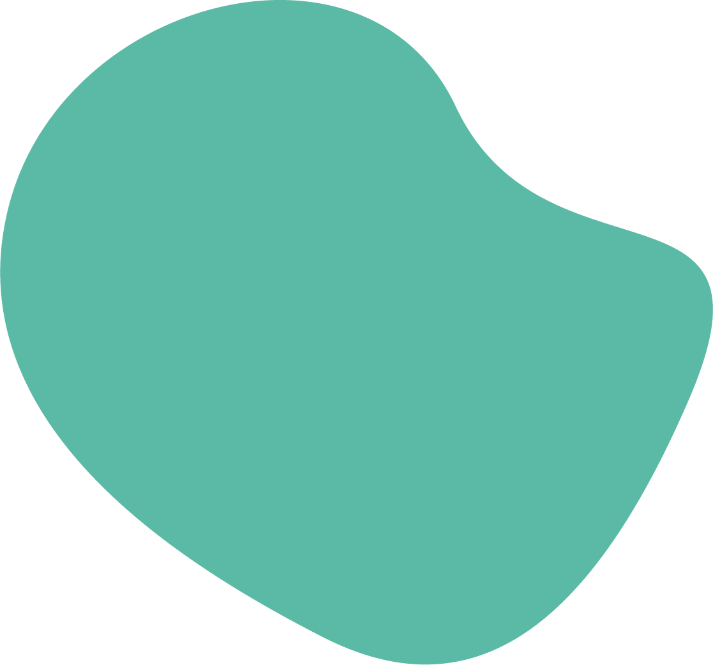
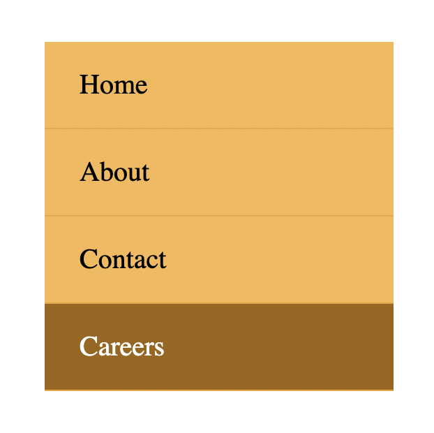
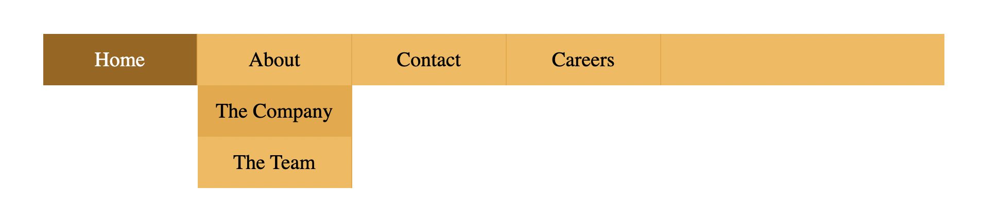
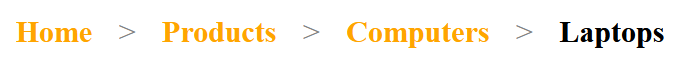
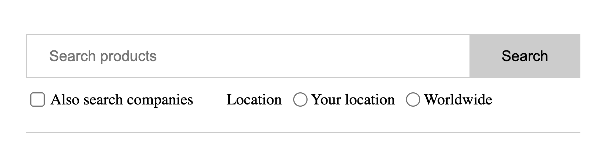

<!-- readme.md -->
<h1 id="Coding-Templates">35 Coding Templates for HTML, CSS, and JavaScript</h1>
<!--~~~~~~~~~~~~~~~~~~~~~~~~~~~~~~~~~~~~~~~~~~~~~~~~~~~~~~~~~~~~~~~~~~~~~~~~~~~~~~~~~~~~~~~~~~~~-->
<!--~~~~~~~~~~~~~~~~~~~~~~~~~~ 01. logo for webdev coding templates ~~~~~~~~~~~~~~~~~~~~~~~~~~~~-->
<!--~~~~~~~~~~~~~~~~~~~~~~~~~~~~~~~~~~~~~~~~~~~~~~~~~~~~~~~~~~~~~~~~~~~~~~~~~~~~~~~~~~~~~~~~~~~~-->

You can edit your own version in one of two ways:

<ol type="1">
  <li>Edit this version to fit your needs</li>
  <li>Go to "File" \&gt; "Download As" \&gt; "Microsoft Word" to Download</li>
</ol>
<!--~~~~~~~~~~~~~~~~~~~~~~~~~~~~~~~~~~~~~~~~~~-->
<h3>How to Use This Template</h3>
<!--~~~~~~~~~~~~~~~~~~~~~~~~~~~~~~~~~~~~~~~~~~-->

Copy and paste these code templates into your CMS for the desired product on your website.

<blockquote>
Remember that you can adjust these to suit your needs. These templates are designed to be 
completely customizable.
</blockquote>

As such, if you need to make any adjustments to these code snippets for a more optimized site, 
you're encouraged to do so.

Jump to a Template

<table>
  <tr>
    <td><a href="#nav-menu-breadcrumbs">Navigation Menus &amp; Breadcrumbs Templates (4 ex's)</a></td>
	<td><a href="#button-transition">Button Transition Templates (3 ex's)</a></td>
  </tr>
  <tr>
    <td><a href="#web-form-search-bar">Web Form &amp; Search Bar Templates (3 ex's)</a></td>
	<td><a href="#lightbox-modal-element">LightBox Modal Element Template (1 example)</a></td>
  </tr>
  <tr>
    <td><a href="#tooltip">Tooltip Templates (4 ex's)</a></td>
	<td><a href="#progress-bar">Progress Bar Templates (2 ex's)</a></td>
  </tr>
  <tr>
    <td><a href="#css-accordian">CSS Accordian Templates (2 ex's)</a></td>
	<td><a href="#css-effects">CSS Effects Templates (4 ex's)</a></td>
  </tr>
  <tr>
    <td><a href="#css-tab-nav">CSS Tab Navigation Templates (2 ex's)</a></td>
	<td><a href="#css-js-slideshow">CSS &amp; JS Slideshow Templates (2 ex's)</a></td>
  </tr>
  <tr>
    <td><a href="#js-onclick-with-css">JS onClick with CSS Templates (3 ex's)</a></td>
	<td><a href="#html-video-audio">HTML Video &amp; Audio Template (1 example)</a></td>
  </tr>
  <tr>
    <td><a href="#css-background">CSS Background Template (1 example)</a></td>
	<td><a href="#css-gradient">CSS Gradient Template (1 example)</a></td>
  </tr>
  <tr>
    <td><a href="#css-overflow">CSS Overflow Template (1 example)</a></td>
	<td><a href="#css-animation">CSS Animation Template (1 example)</a></td>
  </tr>
</table>
<!--~~~~~~~~~~~~~~~~~~~~~~~~~~~~~~~~~~~~~~~~~~-->
<h2 id="nav-menu-breadcrumbs">Example #1 of 4</h2>
<!--~~~~~~~~~~~~~~~~~~~~~~~~~~~~~~~~~~~~~~~~~~~~~~~~~~~~~~~~~~~~~~~~~~~~~~~~~~~~~~~~~~~~~~~~~~~~-->
<!--~~~~~~~~~~~~~~~~~~~~~ 02. example #1 of 4 navigation menu templates ~~~~~~~~~~~~~~~~~~~~~~~~-->
<!--~~~~~~~~~~~~~~~~~~~~~~~~~~~~~~~~~~~~~~~~~~~~~~~~~~~~~~~~~~~~~~~~~~~~~~~~~~~~~~~~~~~~~~~~~~~~-->

<!--~~~~~~~~~~~~~~~~~~~~~~~~~~~~~~~~~~~~~~~~~~-->
<h3>The HTML</h3>
<!--~~~~~~~~~~~~~~~~~~~~~~~~~~~~~~~~~~~~~~~~~~-->

&lt;div class=&quot;container&quot;&gt;
&lt;nav&gt;
> &lt;ul class=&quot;bar&quot;&gt;
> &lt;li&gt;&lt;a href=&quot;#&quot;&gt;Home&lt;/a&gt;&lt;/li&gt;
> &lt;li&gt;&lt;a href=&quot;#&quot;&gt;About&lt;/a&gt;&lt;/li&gt;
> &lt;li&gt;&lt;a href=&quot;#&quot; class=&quot;active&quot;&gt;Contact&lt;/a&gt;&lt;/li&gt;
> &lt;li&gt;&lt;a href=&quot;#&quot;&gt;Careers&lt;/a&gt;&lt;/li&gt;
> &lt;/ul&gt;
&lt;/nav&gt;
&lt;/div&gt;

<!--~~~~~~~~~~~~~~~~~~~~~~~~~~~~~~~~~~~~~~~~~~-->
<h3>The CSS</h3>
<!--~~~~~~~~~~~~~~~~~~~~~~~~~~~~~~~~~~~~~~~~~~-->
<pre>
.bar {
  background-color: rgb(245, 193, 97);
  width: 100%;
  height: 40px;
  display: flex;
  list-style: none;
  padding: 0;
}
.bar li {
  height: 100%;
  width: 100px;
  border-right: 1px solid rgb(235, 177, 69);
}
.bar li a {
  color: black;
  width: 100%;
  height: 100%;
  display: flex;
  align-items: center;
  justify-content: center;
  text-decoration: none;
}
.bar li a:hover {
  background-color: rgb(235, 177, 69);
}
.bar li a.active {
  background-color: rgb(165, 113, 16);
  color: white;
}
</pre>
<!--~~~~~~~~~~~~~~~~~~~~~~~~~~~~~~~~~~~~~~~~~~-->
<h2>Examples #2 of 4</h2>
<!--~~~~~~~~~~~~~~~~~~~~~~~~~~~~~~~~~~~~~~~~~~~~~~~~~~~~~~~~~~~~~~~~~~~~~~~~~~~~~~~~~~~~~~~~~~~~-->
<!--~~~~~~~~~~~~~~~~~~~~~ 03. example #2 of 4 navigation menu templates ~~~~~~~~~~~~~~~~~~~~~~~~-->
<!--~~~~~~~~~~~~~~~~~~~~~~~~~~~~~~~~~~~~~~~~~~~~~~~~~~~~~~~~~~~~~~~~~~~~~~~~~~~~~~~~~~~~~~~~~~~~-->

<!--~~~~~~~~~~~~~~~~~~~~~~~~~~~~~~~~~~~~~~~~~~-->
<h3>The HTML</h3>
<!--~~~~~~~~~~~~~~~~~~~~~~~~~~~~~~~~~~~~~~~~~~-->
<pre>
&lt;div class=&quot;container&quot;&gt;
&lt;nav&gt;
&lt;ul class=&quot;bar&quot;&gt;
&lt;li&gt;&lt;a href=&quot;#&quot;&gt;Home&lt;/a&gt;&lt;/li&gt;
&lt;li&gt;&lt;a href=&quot;#&quot;&gt;About&lt;/a&gt;&lt;/li&gt;
&lt;li&gt;&lt;a href=&quot;#&quot;&gt;Contact&lt;/a&gt;&lt;/li&gt;
&lt;li&gt;&lt;a href=&quot;#&quot; class=&quot;active&quot;&gt;Careers&lt;/a&gt;&lt;/li&gt;
&lt;/ul&gt;
&lt;/nav&gt;
&lt;/div&gt;
</pre>
<!--~~~~~~~~~~~~~~~~~~~~~~~~~~~~~~~~~~~~~~~~~~-->
<h3>The CSS</h3>
<!--~~~~~~~~~~~~~~~~~~~~~~~~~~~~~~~~~~~~~~~~~~-->
<pre>
.bar {
  background-color: rgb(245, 193, 97);
  max-width: 200px;
  width: 100%;
  list-style: none;
  padding: 0;
}
.bar li {
  height: 100%;
  width: 100%;
  height: 50px;
  border-bottom: 1px solid rgb(235, 177, 69);
}
.bar li a {
  padding-left: 20px;
  text-align: left;
  color: black;
  max-width: 100%;
  height: 100%;
  display: flex;
  align-items: center;
  text-decoration: none;
}
.bar li a:hover {
  background-color: rgb(235, 177, 69);
}
.bar li a.active {
  background-color: rgb(165, 113, 16);
  color: white;
}
</pre>
<!--~~~~~~~~~~~~~~~~~~~~~~~~~~~~~~~~~~~~~~~~~~-->
<h2>Third example of 4</h2>
<!--  {width="5.947916666666667in" height="1.09375in"}  -->
<!--~~~~~~~~~~~~~~~~~~~~~~~~~~~~~~~~~~~~~~~~~~~~~~~~~~~~~~~~~~~~~~~~~~~~~~~~~~~~~~~~~~~~~~~~~~~~-->
<!--~~~~~~~~~~~~~~~~~~~~~ 04. example #3 of 4 navigation menu templates ~~~~~~~~~~~~~~~~~~~~~~~~-->
<!--~~~~~~~~~~~~~~~~~~~~~~~~~~~~~~~~~~~~~~~~~~~~~~~~~~~~~~~~~~~~~~~~~~~~~~~~~~~~~~~~~~~~~~~~~~~~-->

<!--~~~~~~~~~~~~~~~~~~~~~~~~~~~~~~~~~~~~~~~~~~-->
<h3>The HTML</h3>
<!--~~~~~~~~~~~~~~~~~~~~~~~~~~~~~~~~~~~~~~~~~~-->
<pre>
&lt;div class=&quot;container&quot;&gt;
&lt;nav&gt;
&lt;ul class=&quot;bar&quot;&gt;
&lt;li&gt;&lt;a href=&quot;#&quot; class=&quot;active&quot;&gt;Home&lt;/a&gt;&lt;/li&gt;
&lt;li class=&quot;has-dropdown&quot;&gt;
&lt;a href=&quot;#&quot;&gt;About&lt;/a&gt;
&lt;ul class=&quot;dropdown&quot;&gt;
&lt;li&gt;&lt;a href=&quot;#&quot;&gt;The Company&lt;/a&gt;&lt;/li&gt;
&lt;li&gt;&lt;a href=&quot;#&quot;&gt;The Team&lt;/a&gt;&lt;/li&gt;
&lt;/ul&gt;
&lt;/li&gt;
&lt;li class=&quot;has-dropdown&quot;&gt;
&lt;a href=&quot;#&quot;&gt;Contact&lt;/a&gt;
&lt;ul class=&quot;dropdown&quot;&gt;
&lt;li&gt;&lt;a href=&quot;#&quot;&gt;Email&lt;/a&gt;&lt;/li&gt;
&lt;li&gt;&lt;a href=&quot;#&quot;&gt;Phone&lt;/a&gt;&lt;/li&gt;
&lt;/ul&gt;
&lt;/li&gt;
&lt;li&gt;&lt;a href=&quot;#&quot;&gt;Careers&lt;/a&gt;&lt;/li&gt;
&lt;/ul&gt;
&lt;/nav&gt;
&lt;/div&gt;
</pre>
<!--~~~~~~~~~~~~~~~~~~~~~~~~~~~~~~~~~~~~~~~~~~-->
<h3>The CSS</h3>
<!--~~~~~~~~~~~~~~~~~~~~~~~~~~~~~~~~~~~~~~~~~~-->
<pre>
&ast; {
  box-sizing: border-box;
}
.bar {
  background-color: rgb(245, 193, 97);
  width: 100%;
  height: 40px;
  display: flex;
  list-style: none;
  padding: 0;
}
.bar li {
  height: 100%;
  width: 120px;
  border-right: 1px solid rgb(235, 177, 69);
}
.bar li a {
  color: black;
  width: 100%;
  height: 100%;
  display: flex;
  align-items: center;
  justify-content: center;
  text-decoration: none;
}
.bar .has-dropdown ul li a{
  padding: 12px 0;
}
.bar li a:hover {
  background-color: rgb(235, 177, 69);
}
.bar li a.active {
  background-color: rgb(165, 113, 16);
  color: white;
}
.dropdown {
  background-color: rgb(245, 193, 97);
  padding: 0;
  list-style: none;
  display: none;
}
.bar li.has-dropdown:hover .dropdown {
  display: block;
}
</pre>
<!--~~~~~~~~~~~~~~~~~~~~~~~~~~~~~~~~~~~~~~~~~~-->
<h2>Fourth example of 4</h2>
<!--  {width="6.5in" height="0.5833333333333334in"}  -->
<!--~~~~~~~~~~~~~~~~~~~~~~~~~~~~~~~~~~~~~~~~~~~~~~~~~~~~~~~~~~~~~~~~~~~~~~~~~~~~~~~~~~~~~~~~~~~~-->
<!--~~~~~~~~~~~~~~~~~~~~~ 05. example #4 of 4 navigation menu templates ~~~~~~~~~~~~~~~~~~~~~~~~-->
<!--~~~~~~~~~~~~~~~~~~~~~~~~~~~~~~~~~~~~~~~~~~~~~~~~~~~~~~~~~~~~~~~~~~~~~~~~~~~~~~~~~~~~~~~~~~~~-->

<!--~~~~~~~~~~~~~~~~~~~~~~~~~~~~~~~~~~~~~~~~~~-->
<h3>The HTML</h3>
<!--~~~~~~~~~~~~~~~~~~~~~~~~~~~~~~~~~~~~~~~~~~-->
<pre>
&lt;div class=&quot;container&quot;&gt;
&lt;ul class=&quot;breadcrumb&quot;&gt;
&lt;li&gt;&lt;a href=&quot;#&quot; class=&quot;active&quot;&gt;Home&lt;/a&gt;&lt;/li&gt;
&lt;li&gt;&lt;span&gt;&gt;&lt;/span&gt;&lt;/li&gt;
&lt;li&gt;&lt;a href=&quot;#&quot;&gt;Products&lt;/a&gt;&lt;/li&gt;
&lt;li&gt;&lt;span&gt;&gt;&lt;/span&gt;&lt;/li&gt;
&lt;li&gt;&lt;a href=&quot;#&quot;&gt;Computers&lt;/a&gt;&lt;/li&gt;
&lt;li&gt;&lt;span&gt;&gt;&lt;/span&gt;&lt;/li&gt;
&lt;li&gt;&lt;a href=&quot;#&quot; class=&quot;unique&quot;&gt;Laptops&lt;/a&gt;&lt;/li&gt;
&lt;/ul&gt;
&lt;/div&gt;
</pre>
<!--~~~~~~~~~~~~~~~~~~~~~~~~~~~~~~~~~~~~~~~~~~-->
<h3>The CSS</h3>
<!--~~~~~~~~~~~~~~~~~~~~~~~~~~~~~~~~~~~~~~~~~~-->
<pre>
.breadcrumb {
  list-style: none;
  padding: 0;
  display: flex;
  font-size: 20px;
  justify-content: space-around;
  max-width: 450px;
}
.breadcrumb a {
  text-decoration: none;
  color: rgb(110, 110, 110);
  font-weight: bold;
}
.breadcrumb li span{
  color: gray;
}
.breadcrumb li a {
  color: orange;
  transition: color 300ms;
}
.breadcrumb li .unique {
  color: #000;
}
.breadcrumb li a:hover {
  color: rgb(176, 115, 0);
}
</pre>
<!--~~~~~~~~~~~~~~~~~~~~~~~~~~~~~~~~~~~~~~~~~~-->
<h2 id="button-transition">3 Button Transition Templates</h2>
<!--~~~~~~~~~~~~~~~~~~~~~~~~~~~~~~~~~~~~~~~~~~-->
<h2>Example #1 of 3</h2>
<!--~~~~~~~~~~~~~~~~~~~~~~~~~~~~~~~~~~~~~~~~~~-->
{width="6.5in" height="1.5138888888888888in"}

<h3>The HTML</h3>
<pre>
&lt;button class=&quot;first&quot;&gt;Hover over me&lt;/button&gt;
</pre>
<h3>The CSS</h3>
<pre>
.first {

padding: 10px;

font-size: 20px;

background-color: black;

color: white;

border: none;

cursor: pointer;

box-shadow: 0 0 0 #ccc;

transition: box-shadow 300ms, color 300ms;

}

.first:hover {

color: yellow;

box-shadow: 10px 10px 0 rgb(219, 219, 219);

}
</pre>
<!--~~~~~~~~~~~~~~~~~~~~~~~~~~~~~~~~~~~~~~~~~~-->
<h2>Example #2 of 3</h2>
<!--~~~~~~~~~~~~~~~~~~~~~~~~~~~~~~~~~~~~~~~~~~-->

{width="2.557292213473316in"
height="1.1195516185476815in"}{width="4.078125546806649in"
height="1.9507917760279965in"}

<!--~~~~~~~~~~~~~~~~~~~~~~~~~~~~~~~~~~~~~~~~~~-->
<h3>The HTML</h3>
<!--~~~~~~~~~~~~~~~~~~~~~~~~~~~~~~~~~~~~~~~~~~-->
<pre>
&lt;button class=&quot;second&quot;&gt;Click me&lt;/button&gt;
</pre>
<!--~~~~~~~~~~~~~~~~~~~~~~~~~~~~~~~~~~~~~~~~~~-->
<h3>The CSS</h3>
<!--~~~~~~~~~~~~~~~~~~~~~~~~~~~~~~~~~~~~~~~~~~-->
<pre>
.second {

width: 180px;

height: 60px;

display: flex;

align-items: center;

justify-content: center;

font-size: 20px;

background-color: rgb(85, 16, 16);

color: white;

border: none;

cursor: pointer;

transition: transform 150ms,

font-size 150ms, color 150ms;

}

.second:active {

background-color: rgb(63, 5, 5);

font-size: 12px;

transform: scale(1.3);

box-shadow: 5px 5px 10px rgb(119, 119, 119);

}
</pre>
<!--~~~~~~~~~~~~~~~~~~~~~~~~~~~~~~~~~~~~~~~~~~-->
<h2>Example #3 of 3</h2>
<!--~~~~~~~~~~~~~~~~~~~~~~~~~~~~~~~~~~~~~~~~~~-->

{width="2.0833333333333335in"
height="0.53125in"}{width="2.2604166666666665in"
height="0.7291666666666666in"}{width="1.8854166666666667in"
height="0.6354166666666666in"}

<!--~~~~~~~~~~~~~~~~~~~~~~~~~~~~~~~~~~~~~~~~~~-->
<h3>The HTML</h3>
<!--~~~~~~~~~~~~~~~~~~~~~~~~~~~~~~~~~~~~~~~~~~-->
<pre>
&lt;button class=&quot;third&quot;&gt;Hover over me&lt;/button&gt;
</pre>
<!--~~~~~~~~~~~~~~~~~~~~~~~~~~~~~~~~~~~~~~~~~~-->
<h3>The CSS</h3>
<!--~~~~~~~~~~~~~~~~~~~~~~~~~~~~~~~~~~~~~~~~~~-->
<pre>
.third {

border: none;

background: none;

width: 120px;

height: 40px;

cursor: pointer;

position: relative;

color: black;

transition: color 500ms;

overflow: hidden;

}

.third::after {

content: &quot;&quot;;

background-color: #333;

color: white;

position: absolute;

left: 0;

bottom: -40px;

width: 100%;

height: 100%;

transition: bottom 500ms;

z-index: -1;

}

.third:hover {

color: white;

}

.third:hover::after {

bottom: 0;

}
</pre>
<!--~~~~~~~~~~~~~~~~~~~~~~~~~~~~~~~~~~~~~~~~~~-->
<h2>3 Web Form & Search Bar Templates</h2>
<!--~~~~~~~~~~~~~~~~~~~~~~~~~~~~~~~~~~~~~~~~~~-->

[]{#9jhjudypc6m5 .anchor}

<!--~~~~~~~~~~~~~~~~~~~~~~~~~~~~~~~~~~~~~~~~~~-->
<h2>Template #1</h2>
<!--~~~~~~~~~~~~~~~~~~~~~~~~~~~~~~~~~~~~~~~~~~-->

{width="6.5in"
height="1.7916666666666667in"}

<!--~~~~~~~~~~~~~~~~~~~~~~~~~~~~~~~~~~~~~~~~~~-->
## The HTML
<!--~~~~~~~~~~~~~~~~~~~~~~~~~~~~~~~~~~~~~~~~~~-->
<pre>
&lt;form&gt;

&lt;div class=&quot;search&quot;&gt;

&lt;input type=&quot;text&quot; placeholder=&quot;Search products&quot; /&gt;

&lt;button type=&quot;submit&quot;&gt;Search&lt;/button&gt;

&lt;/div&gt;

&lt;div class=&quot;align-center bottom&quot;&gt;

&lt;div class=&quot;checkbox-block&quot;&gt;

&lt;input

type=&quot;checkbox&quot;

name=&quot;companies_included&quot;

id=&quot;companies_included&quot;

/&gt;

&lt;label for=&quot;companies_included&quot;

&gt;Also search companies

&lt;/label&gt;

&lt;/div&gt;

&lt;div class=&quot;inline-flex radio-block&quot;&gt;

&lt;span&gt;Location&lt;/span&gt;

&lt;div class=&quot;inline-flex align-center&quot;&gt;

&lt;input

type=&quot;radio&quot;

name=&quot;location&quot;

value=&quot;Your location&quot;

id=&quot;your_location&quot;

/&gt;

&lt;label for=&quot;your_location&quot;&gt; Your location &lt;/label&gt;

&lt;/div&gt;

&lt;div class=&quot;inline-flex align-center&quot;&gt;

&lt;input

type=&quot;radio&quot;

name=&quot;location&quot;

value=&quot;Worldwide&quot;

id=&quot;worldwide&quot;

/&gt;

&lt;label for=&quot;worldwide&quot;&gt; Worldwide &lt;/label&gt;

&lt;/div&gt;

&lt;/div&gt;

&lt;/div&gt;

&lt;/form&gt;
</pre>
<!--~~~~~~~~~~~~~~~~~~~~~~~~~~~~~~~~~~~~~~~~~~-->
## The CSS
<!--~~~~~~~~~~~~~~~~~~~~~~~~~~~~~~~~~~~~~~~~~~-->
<pre>
.align-center {

display: flex;

align-items: center;

}

.inline-flex {

display: inline-flex;

}

form {

padding: 20px 0;

max-width: 500px;

border-bottom: 1px solid #ccc;

}

.search {

display: flex;

outline: 1px solid #cccccc;

}

.search &gt; input {

flex-grow: 1;

border: 0;

padding: 0.5rem 1rem;

font-size: 1rem;

}

.search &gt; input:focus {

outline: none;

}

.search &gt; button {

padding: 0.8rem 2rem;

border: 0;

cursor: pointer;

font-size: 1rem;

background: #cccccc;

}

.bottom {

margin-top: 10px;

font-size: 14px;

}

.checkbox-block {

display: flex;

align-items: center;

margin-right: 30px;

}

.checkbox-block input {

margin-right: 5px;

cursor: pointer;

}

.radio-block input {

margin: 0 3px 0 10px;

}
</pre>
<!--~~~~~~~~~~~~~~~~~~~~~~~~~~~~~~~~~~~~~~~~~~-->
# Template #2
<!--~~~~~~~~~~~~~~~~~~~~~~~~~~~~~~~~~~~~~~~~~~-->

{width="6.5in"
height="4.513888888888889in"}

<!--~~~~~~~~~~~~~~~~~~~~~~~~~~~~~~~~~~~~~~~~~~-->
## The HTML
<!--~~~~~~~~~~~~~~~~~~~~~~~~~~~~~~~~~~~~~~~~~~-->
<pre>
&lt;form&gt;

&lt;div class=&quot;input-group&quot;&gt;

&lt;label for=&quot;fname&quot;&gt;Firstname&lt;/label&gt;

&lt;input

id=&quot;fname&quot;

name=&quot;fname&quot;

placeholder=&quot;Enter firstname&quot;

required=&quot;required&quot;

/&gt;

&lt;/div&gt;

&lt;div class=&quot;input-group&quot;&gt;

&lt;label for=&quot;lname&quot;&gt;Lastname&lt;/label&gt;

&lt;input

id=&quot;lname&quot;

name=&quot;lname&quot;

placeholder=&quot;Enter lastname&quot;

required=&quot;required&quot;

/&gt;

&lt;/div&gt;

&lt;div class=&quot;input-group&quot;&gt;

&lt;label for=&quot;email&quot;&gt;Email&lt;/label&gt;

&lt;input

id=&quot;email&quot;

type=&quot;email&quot;

name=&quot;email&quot;

placeholder=&quot;Enter your email&quot;

/&gt;

&lt;/div&gt;

&lt;div class=&quot;input-group&quot;&gt;

&lt;label&gt;Country&lt;/label&gt;

&lt;select name=&quot;country&quot; id=&quot;country&quot; required=&quot;required&quot;&gt;

&lt;option value=&quot;&quot; selected=&quot;selected&quot;&gt;Select country&lt;/option&gt;

&lt;option value=&quot;Afghanistan&quot;&gt;Afghanistan&lt;/option&gt;

&lt;option value=&quot;Albania&quot;&gt;Albania&lt;/option&gt;

&lt;option value=&quot;Algeria&quot;&gt;Algeria&lt;/option&gt;

&lt;option value=&quot;American Samoa&quot;&gt;American Samoa&lt;/option&gt;

&lt;option value=&quot;Andorra&quot;&gt;Andorra&lt;/option&gt;

&lt;option value=&quot;Angola&quot;&gt;Angola&lt;/option&gt;

&lt;option value=&quot;Anguilla&quot;&gt;Anguilla&lt;/option&gt;

&lt;option value=&quot;Antarctica&quot;&gt;Antarctica&lt;/option&gt;

&lt;/select&gt;

&lt;/div&gt;

&lt;div class=&quot;input-group&quot;&gt;

&lt;label for=&quot;message&quot;&gt;Any message?&lt;/label&gt;

&lt;textarea

id=&quot;message&quot;

name=&quot;message&quot;

placeholder=&quot;Optional&quot;

&gt;&lt;/textarea&gt;

&lt;/div&gt;

&lt;div class=&quot;submit-group&quot;&gt;

&lt;button type=&quot;submit&quot;&gt;Submit form&lt;/button&gt;

&lt;/div&gt;

&lt;/form&gt;
</pre>
<!--~~~~~~~~~~~~~~~~~~~~~~~~~~~~~~~~~~~~~~~~~~-->
## The CSS
<!--~~~~~~~~~~~~~~~~~~~~~~~~~~~~~~~~~~~~~~~~~~-->
<pre>
&ast; {

box-sizing: border-box;

}

body {

margin: 30px;

}

form {

border: 1px solid #333;

padding: 20px;

max-width: 400px;

margin: 0 auto;

border-radius: 5px;

}

.input-group {

display: flex;

margin-bottom: 10px;

}

label {

width: 100px;

}

input,

select,

textarea {

flex: 1;

padding: 3px 5px;

}

.submit-group {

display: flex;

align-items: center;

justify-content: center;

margin-top: 20px;

}

button {

width: 100px;

margin: 0 auto;

background-color: black;

color: white;

border: none;

padding: 10px;

cursor: pointer;

border-radius: 5px;

}
</pre>
<!--~~~~~~~~~~~~~~~~~~~~~~~~~~~~~~~~~~~~~~~~~~-->
# Template #2
<!--~~~~~~~~~~~~~~~~~~~~~~~~~~~~~~~~~~~~~~~~~~-->

{width="3.7226859142607176in"
height="5.776042213473316in"}

<!--~~~~~~~~~~~~~~~~~~~~~~~~~~~~~~~~~~~~~~~~~~-->
## The HTML
<!--~~~~~~~~~~~~~~~~~~~~~~~~~~~~~~~~~~~~~~~~~~-->
<pre>
&lt;form&gt;

&lt;div&gt;

&lt;span class=&quot;question&quot;&gt;1. How did you hear about us?&lt;/span&gt;

&lt;div class=&quot;radio-group&quot;&gt;

&lt;div class=&quot;radio-item&quot;&gt;

&lt;input type=&quot;radio&quot; name=&quot;hear_about_us&quot; id=&quot;twitter&quot; /&gt;

&lt;label for=&quot;twitter&quot;&gt;Twitter&lt;/label&gt;

&lt;/div&gt;

&lt;div class=&quot;radio-item&quot;&gt;

&lt;input type=&quot;radio&quot; name=&quot;hear_about_us&quot; id=&quot;facebook&quot; /&gt;

&lt;label for=&quot;facebook&quot;&gt;Facebook&lt;/label&gt;

&lt;/div&gt;

&lt;div class=&quot;radio-item&quot;&gt;

&lt;input type=&quot;radio&quot; name=&quot;hear_about_us&quot; id=&quot;other&quot; /&gt;

&lt;label for=&quot;other&quot;&gt;Other&lt;/label&gt;

&lt;/div&gt;

&lt;/div&gt;

&lt;/div&gt;

&lt;div&gt;

&lt;span class=&quot;question&quot;&gt;2. Where do you live?&lt;/span&gt;

&lt;select name=&quot;country&quot; id=&quot;country&quot; required=&quot;required&quot;&gt;

&lt;option value=&quot;&quot; selected=&quot;selected&quot;&gt;Select country&lt;/option&gt;

&lt;option value=&quot;Afghanistan&quot;&gt;Afghanistan&lt;/option&gt;

&lt;option value=&quot;Albania&quot;&gt;Albania&lt;/option&gt;

&lt;option value=&quot;Algeria&quot;&gt;Algeria&lt;/option&gt;

&lt;option value=&quot;American Samoa&quot;&gt;American Samoa&lt;/option&gt;

&lt;option value=&quot;Andorra&quot;&gt;Andorra&lt;/option&gt;

&lt;option value=&quot;Angola&quot;&gt;Angola&lt;/option&gt;

&lt;option value=&quot;Anguilla&quot;&gt;Anguilla&lt;/option&gt;

&lt;option value=&quot;Antarctica&quot;&gt;Antarctica&lt;/option&gt;

&lt;/select&gt;

&lt;/div&gt;

&lt;div&gt;

&lt;span class=&quot;question&quot;&gt;3. You age range&lt;/span&gt;

&lt;div class=&quot;radio-group&quot;&gt;

&lt;div class=&quot;radio-item&quot;&gt;

&lt;input type=&quot;radio&quot; name=&quot;age_range&quot; id=&quot;lower&quot; /&gt;

&lt;label for=&quot;lower&quot;&gt;18-25&lt;/label&gt;

&lt;/div&gt;

&lt;div class=&quot;radio-item&quot;&gt;

&lt;input type=&quot;radio&quot; name=&quot;age_range&quot; id=&quot;middle&quot; /&gt;

&lt;label for=&quot;middle&quot;&gt;26-35&lt;/label&gt;

&lt;/div&gt;

&lt;div class=&quot;radio-item&quot;&gt;

&lt;input type=&quot;radio&quot; name=&quot;age_range&quot; id=&quot;higher&quot; /&gt;

&lt;label for=&quot;higher&quot;&gt;36 or more&lt;/label&gt;

&lt;/div&gt;

&lt;/div&gt;

&lt;/div&gt;

&lt;div&gt;

&lt;span class=&quot;question&quot;&gt;4. Anything else we should know? &lt;/span&gt;

&lt;textarea name=&quot;message&quot;&gt;&lt;/textarea&gt;

&lt;/div&gt;

&lt;div&gt;

&lt;button class=&quot;submit-btn&quot;&gt;Submit survey&lt;/button&gt;

&lt;/div&gt;

&lt;/form&gt;
</pre>
<!--~~~~~~~~~~~~~~~~~~~~~~~~~~~~~~~~~~~~~~~~~~-->
## The CSS
<!--~~~~~~~~~~~~~~~~~~~~~~~~~~~~~~~~~~~~~~~~~~-->
<pre>

&ast; {

box-sizing: border-box;

}

body {

margin: 30px;

}

form {

max-width: 400px;

}

form &gt; div {

margin-bottom: 20px;

}

.question {

font-weight: bold;

display: block;

margin-bottom: 5px;

}

.radio-group,

select,

textarea {

margin-left: 15px;

width: 200px;

}

textarea {

padding: 10px;

}

.radio-item {

display: flex;

align-items: center;

margin-bottom: 3px;

}

.radio-item label {

margin-left: 5px;

}

.radio-item input {

margin: 0;

}

.submit-btn {

margin-left: 15px;

background-color: #555;

border: 1px solid #555;

color: white;

padding: 10px;

cursor: pointer;

}
</pre>
<!--~~~~~~~~~~~~~~~~~~~~~~~~~~~~~~~~~~~~~~~~~~-->
<h2 id="lightbox-modal-element">Lightbox Modal Element Template (1 example)</h2>
<!--~~~~~~~~~~~~~~~~~~~~~~~~~~~~~~~~~~~~~~~~~~-->
<h3>Template</h3>
<!--~~~~~~~~~~~~~~~~~~~~~~~~~~~~~~~~~~~~~~~~~~-->

{width="5.598958880139983in"
height="0.7088429571303587in"}

{width="5.619792213473316in"
height="3.2331813210848646in"}

{width="5.692708880139983in"
height="3.270278871391076in"}

<!--~~~~~~~~~~~~~~~~~~~~~~~~~~~~~~~~~~~~~~~~~~-->
<h3>The HTML</h3>
<!--~~~~~~~~~~~~~~~~~~~~~~~~~~~~~~~~~~~~~~~~~~-->
<pre>

&lt;div class=&quot;images&quot;&gt;

&lt;img onclick=&quot;openModal(0)&quot; id=&quot;image0&quot; /&gt;

&lt;img onclick=&quot;openModal(1)&quot; id=&quot;image1&quot; /&gt;

&lt;img onclick=&quot;openModal(2)&quot; id=&quot;image2&quot; /&gt;

&lt;img onclick=&quot;openModal(3)&quot; id=&quot;image3&quot; /&gt;

&lt;/div&gt;

&lt;div id=&quot;lightbox&quot; class=&quot;lightbox&quot;&gt;

&lt;button onclick=&quot;closeModal()&quot; class=&quot;close-btn&quot;&gt;

Close

&lt;/button&gt;

&lt;div class=&quot;image-preview&quot;&gt;

&lt;img id=&quot;preview-image&quot; /&gt;

&lt;/div&gt;

&lt;div class=&quot;control-btns&quot;&gt;

&lt;button onclick=&quot;control(-1)&quot; class=&quot;control-left&quot;&gt;

&lt;

&lt;/button&gt;

&lt;button onclick=&quot;control(1)&quot; class=&quot;control-left&quot;&gt;

&gt;

&lt;/button&gt;

&lt;/div&gt;

&lt;div id=&quot;modal-images-block&quot; class=&quot;lightbox\_\_images&quot;&gt;

&lt;img onclick=&quot;openModal(0)&quot; id=&quot;l-image0&quot; /&gt;

&lt;img onclick=&quot;openModal(1)&quot; id=&quot;l-image1&quot; /&gt;

&lt;img onclick=&quot;openModal(2)&quot; id=&quot;l-image2&quot; /&gt;

&lt;img onclick=&quot;openModal(3)&quot; id=&quot;l-image3&quot; /&gt;

&lt;/div&gt;

&lt;/div&gt;

<h3>The CSS</h3>

&ast; {

box-sizing: border-box;

}

.images {

display: grid;

grid-template-columns: repeat(4, 1fr);

grid-gap: 20px;

}

.images img {

width: 100%;

height: 100%;

cursor: pointer;

}

.lightbox {

position: absolute;

left: 0;

top: 0;

padding: 0 50px 30px;

width: 100%;

height: 100vh;

background-color: rgb(18, 7, 7);

display: none;

flex-direction: column;

}

.lightbox.visible {

display: flex;

}

.lightbox .close-btn {

width: 80px;

align-self: flex-end;

height: 40px;

margin: 20px 0;

}

.lightbox .image-preview {

width: 100%;

margin: 0 auto;

flex: 1;

height: 100%;

overflow: hidden;

display: flex;

flex-direction: column;

align-items: center;

}

.image-preview img {

width: 100%;

height: 100%;

object-fit: cover;

}

.control-btns {

position: relative;

top: -10px;

margin: 0 auto;

}

.control-btns button {

cursor: pointer;

}

.control-left {

margin-right: 50px;

}

.lightbox\_\_images {

height: 300px;

display: grid;

grid-template-columns: repeat(4, 1fr);

grid-gap: 20px;

align-items: center;

}

.lightbox\_\_images img {

width: 100%;

opacity: 0.3;

cursor: pointer;

}

.lightbox\_\_images img.active {

width: 100%;

opacity: 1;

}
</pre>
<!--~~~~~~~~~~~~~~~~~~~~~~~~~~~~~~~~~~~~~~~~~~-->
## The JavaScript
<!--~~~~~~~~~~~~~~~~~~~~~~~~~~~~~~~~~~~~~~~~~~-->
<pre>

const IMAGE0 =

&quot;https://i.picsum.photos/id/229/400/200.jpg?hmac=ULnwo8IFtjR3PshWPNEvFWNU8Xwl_OIeUtVmZIQanhU&quot;

const IMAGE1 =

&quot;https://i.picsum.photos/id/154/400/200.jpg?hmac=uhKcJIPoFcq2xMC16yvZAwA8sTeIbThUr-Njq0DkhSU&quot;

const IMAGE2 =

&quot;https://i.picsum.photos/id/690/400/200.jpg?hmac=kOkDXkZEUaSUQviVm67apRu5EPMD_L0rHfKVt32iogQ&quot;

const IMAGE3 =

&quot;https://i.picsum.photos/id/633/400/200.jpg?hmac=-axbA3Zg3r_xPYOy7OdaIb5yTFDBKubd9LYJrnwpHeU&quot;

const images = \[IMAGE0, IMAGE1, IMAGE2, IMAGE3\]

const image0 = document.getElementById(&quot;image0&quot;)

const image1 = document.getElementById(&quot;image1&quot;)

const image2 = document.getElementById(&quot;image2&quot;)

const image3 = document.getElementById(&quot;image3&quot;)

const lightbox = document.getElementById(&quot;lightbox&quot;)

const previewImg = document.getElementById(&quot;preview-image&quot;)

const modalImagesBlock = document.getElementById(

&quot;modal-images-block&quot;

)

image0.src = IMAGE0

image1.src = IMAGE1

image2.src = IMAGE2

image3.src = IMAGE3

let activeId = null

previewImg.src = images\[0\]

const modalImagesElements =

modalImagesBlock.getElementsByTagName(&quot;img&quot;)

const modalImages = Object.values(modalImagesElements)

modalImages.forEach((imageElement, i) =&gt; {

console.log(imageElement)

imageElement.src = images\[i\]

})

function openModal(imgId) {

if (activeId !== null) {

modalImages\[activeId\].classList.remove(&quot;active&quot;)

}

activeId = imgId

lightbox.classList.add(&quot;visible&quot;)

previewImg.src = images\[imgId\]

modalImages\[imgId\].classList.add(&quot;active&quot;)

}

function closeModal() {

lightbox.classList.remove(&quot;visible&quot;)

}

function control(direction) {

const prevId = activeId

if (direction === 1) {

// next

activeId =

activeId + 1 &gt; images.length - 1

? // then go to the beginning

(activeId = 0)

: (activeId = activeId + 1)

} else {

// previous

activeId =

activeId - 1 &lt; 0

? // then go to the end

(activeId = images.length - 1)

: activeId - 1

}

previewImg.src = images\[activeId\]

modalImages\[activeId\].classList.add(&quot;active&quot;)

modalImages\[prevId\].classList.remove(&quot;active&quot;)

}

[]{#kdb634vxe28v .anchor}
</pre>
<!--~~~~~~~~~~~~~~~~~~~~~~~~~~~~~~~~~~~~~~~~~~-->
# Example #1
<!--~~~~~~~~~~~~~~~~~~~~~~~~~~~~~~~~~~~~~~~~~~-->

{width="3.5208333333333335in"
height="1.4479166666666667in"}

<!--~~~~~~~~~~~~~~~~~~~~~~~~~~~~~~~~~~~~~~~~~~-->
## The HTML
<!--~~~~~~~~~~~~~~~~~~~~~~~~~~~~~~~~~~~~~~~~~~-->
<pre>

&lt;div class=&quot;tooltip&quot;&gt;

&lt;span&gt;Top&lt;/span&gt;

&lt;div class=&quot;tooltip-text&quot;&gt;This is the top of the tooltip&lt;/div&gt;

&lt;/div&gt;
</pre>
<!--~~~~~~~~~~~~~~~~~~~~~~~~~~~~~~~~~~~~~~~~~~-->
## The CSS
<!--~~~~~~~~~~~~~~~~~~~~~~~~~~~~~~~~~~~~~~~~~~-->
<pre>

body {

margin: 60px;

}

.tooltip {

position: relative;

display: inline-block;

}

.tooltip-text {

padding: 6px;

background-color: #333;

color: white;

font-size: 12px;

position: absolute;

border-radius: 5px;

width: 100px;

text-align: center;

display: inline-block;

top: -45px;

left: -12px;

visibility: hidden;

}

.tooltip-text::after {

content: &quot;&quot;;

position: absolute;

left: 10px;

bottom: -5px;

width: 0;

height: 0;

border-left: 7px solid transparent;

border-right: 7px solid transparent;

border-top: 10px solid #333;

}

.tooltip:hover .tooltip-text {

visibility: visible;

}
</pre>
<!--~~~~~~~~~~~~~~~~~~~~~~~~~~~~~~~~~~~~~~~~~~-->
# Example #2
<!--~~~~~~~~~~~~~~~~~~~~~~~~~~~~~~~~~~~~~~~~~~-->

{width="4.0625in" height="1.03125in"}

<!--~~~~~~~~~~~~~~~~~~~~~~~~~~~~~~~~~~~~~~~~~~-->
## The HTML
<!--~~~~~~~~~~~~~~~~~~~~~~~~~~~~~~~~~~~~~~~~~~-->
<pre>

&lt;div class=&quot;tooltip&quot;&gt;

&lt;span&gt;Right&lt;/span&gt;

&lt;div class=&quot;tooltip-text&quot;&gt;This is the right of the tooltip&lt;/div&gt;

&lt;/div&gt;
</pre>
<!--~~~~~~~~~~~~~~~~~~~~~~~~~~~~~~~~~~~~~~~~~~-->
## The CSS
<!--~~~~~~~~~~~~~~~~~~~~~~~~~~~~~~~~~~~~~~~~~~-->
<pre>

.tooltip {

position: relative;

display: inline-block;

}

.tooltip-text {

padding: 6px;

background-color: #333;

color: white;

font-size: 12px;

position: absolute;

border-radius: 5px;

width: 100px;

text-align: center;

right: -120px;

bottom: -7px;

visibility: hidden;

}

.tooltip-text::after {

content: &quot;&quot;;

position: absolute;

left: -5px;

bottom: 10px;

width: 0;

height: 0;

border-top: 7px solid transparent;

border-bottom: 7px solid transparent;

border-right: 10px solid #333;

}

.tooltip:hover .tooltip-text {

visibility: visible;

}
</pre>

<!--~~~~~~~~~~~~~~~~~~~~~~~~~~~~~~~~~~~~~~~~~~-->
# Example #3
<!--~~~~~~~~~~~~~~~~~~~~~~~~~~~~~~~~~~~~~~~~~~-->

{width="3.2916666666666665in"
height="1.4583333333333333in"}

<!--~~~~~~~~~~~~~~~~~~~~~~~~~~~~~~~~~~~~~~~~~~-->
## The HTML
<!--~~~~~~~~~~~~~~~~~~~~~~~~~~~~~~~~~~~~~~~~~~-->
<pre>

&lt;div class=&quot;tooltip&quot;&gt;

&lt;span&gt;Bottom&lt;/span&gt;

&lt;div class=&quot;tooltip-text&quot;&gt; This is the bottom of the tooltip
&lt;/div&gt;

&lt;/div&gt;
</pre>
<!--~~~~~~~~~~~~~~~~~~~~~~~~~~~~~~~~~~~~~~~~~~-->
## The CSS
<!--~~~~~~~~~~~~~~~~~~~~~~~~~~~~~~~~~~~~~~~~~~-->
<pre>
.tooltip {

position: relative;

display: inline-block;

}

.tooltip-text {

padding: 6px;

background-color: #333;

color: white;

font-size: 12px;

position: absolute;

border-radius: 5px;

width: 100px;

text-align: center;

display: inline-block;

bottom: -46px;

left: -10px;

visibility: hidden;

}

.tooltip-text::after {

content: &quot;&quot;;

position: absolute;

left: 10px;

top: -5px;

width: 0;

height: 0;

border-left: 7px solid transparent;

border-right: 7px solid transparent;

border-bottom: 10px solid #333;

}

.tooltip:hover .tooltip-text {

visibility: visible;

}
</pre>
<!--~~~~~~~~~~~~~~~~~~~~~~~~~~~~~~~~~~~~~~~~~~-->
# Example #4
<!--~~~~~~~~~~~~~~~~~~~~~~~~~~~~~~~~~~~~~~~~~~-->

{width="3.6041666666666665in"
height="0.9166666666666666in"}

<!--~~~~~~~~~~~~~~~~~~~~~~~~~~~~~~~~~~~~~~~~~~-->
## The HTML
<!--~~~~~~~~~~~~~~~~~~~~~~~~~~~~~~~~~~~~~~~~~~-->
<pre>

&lt;div class=&quot;tooltip&quot;&gt;

&lt;span&gt;Left&lt;/span&gt;

&lt;div class=&quot;tooltip-text&quot;&gt;This is the left of the tooltip&lt;/div&gt;

&lt;/div&gt;

The CSS

body {

margin: 60px 130px;

}

.tooltip {

position: relative;

display: inline-block;

}

.tooltip-text {

padding: 6px;

background-color: #333;

color: white;

font-size: 12px;

position: absolute;

border-radius: 5px;

width: 100px;

text-align: center;

left: -120px;

bottom: -11px;

visibility: hidden;

}

.tooltip-text::after {

content: &quot;&quot;;

position: absolute;

right: -5px;

top: 12px;

width: 0;

height: 0;

border-top: 7px solid transparent;

border-bottom: 7px solid transparent;

border-left: 10px solid #333;

}

.tooltip:hover .tooltip-text {

visibility: visible;

}

</pre>
<!--~~~~~~~~~~~~~~~~~~~~~~~~~~~~~~~~~~~~~~~~~~-->
# 2 Progress Bar Templates
<!--~~~~~~~~~~~~~~~~~~~~~~~~~~~~~~~~~~~~~~~~~~-->
# Example #1
<!--~~~~~~~~~~~~~~~~~~~~~~~~~~~~~~~~~~~~~~~~~~-->
## {width="5.375in" height="0.875in"}
<!--~~~~~~~~~~~~~~~~~~~~~~~~~~~~~~~~~~~~~~~~~~-->
## The HTML
<!--~~~~~~~~~~~~~~~~~~~~~~~~~~~~~~~~~~~~~~~~~~-->
<pre>
&lt;progress class=&quot;first&quot; value=&quot;50&quot; max=&quot;100&quot;&gt;&lt;/progress&gt;
</pre>

<!--~~~~~~~~~~~~~~~~~~~~~~~~~~~~~~~~~~~~~~~~~~-->
## The CSS
<!--~~~~~~~~~~~~~~~~~~~~~~~~~~~~~~~~~~~~~~~~~~-->
<pre>

.first {

border-radius: 0;

border: 2px solid purple;

height: 30px;

width: 250px;

}

.first::-webkit-progress-bar {

background-color: white;

}

.first::-webkit-progress-value {

background-color: purple;

}
</pre>
<!--~~~~~~~~~~~~~~~~~~~~~~~~~~~~~~~~~~~~~~~~~~-->
# Example #2
<!--~~~~~~~~~~~~~~~~~~~~~~~~~~~~~~~~~~~~~~~~~~-->
## The HTML
<!--~~~~~~~~~~~~~~~~~~~~~~~~~~~~~~~~~~~~~~~~~~-->
<pre>

&lt;progress class=&quot;second&quot; value=&quot;40&quot; max=&quot;100&quot;&gt;&lt;/progress&gt;

{width="5.083333333333333in"
height="0.7395833333333334in"}

&lt;progress class=&quot;second&quot; value=&quot;80&quot; max=&quot;100&quot;&gt;&lt;/progress&gt;

{width="5.0in" height="0.78125in"}
</pre>
<!--~~~~~~~~~~~~~~~~~~~~~~~~~~~~~~~~~~~~~~~~~~-->
## The CSS
<!--~~~~~~~~~~~~~~~~~~~~~~~~~~~~~~~~~~~~~~~~~~-->
<pre>

.second {

overflow: hidden;

border-radius: 15px;

height: 30px;

width: 200px;

}

.second::-webkit-progress-bar {

border-radius: 15px;

background-color: white;

border: 1px solid #ccc;

}

.second::-webkit-progress-value {

background-image: linear-gradient(

90deg,

hsl(0deg 91% 46%) 25px,

hsl(41deg 100% 50%) 50px,

hsl(63deg 100% 37%) 75px,

rgb(85, 255, 0) 100px

);

border-radius: 15px;

}
</pre>
<!--~~~~~~~~~~~~~~~~~~~~~~~~~~~~~~~~~~~~~~~~~~-->
# 2 CSS Accordian Templates
<!--~~~~~~~~~~~~~~~~~~~~~~~~~~~~~~~~~~~~~~~~~~-->
# Example #1: Accordion Using Only CSS and HTML
<!--~~~~~~~~~~~~~~~~~~~~~~~~~~~~~~~~~~~~~~~~~~-->
## The HTML
<!--~~~~~~~~~~~~~~~~~~~~~~~~~~~~~~~~~~~~~~~~~~-->
<pre>

&lt;!DOCTYPE html&gt;

&lt;html lang=&quot;en&quot;&gt;

&lt;head&gt;

&lt;title&gt;Document&lt;/title&gt;

&lt;link rel=&quot;stylesheet&quot; href=&quot;style.css&quot; /&gt;

&lt;/head&gt;

&lt;body&gt;

&lt;div class=&quot;container&quot;&gt;

&lt;h1&gt;CSS Accordion&lt;/h1&gt;

&lt;div class=&quot;accordion&quot;&gt;

&lt;div class=&quot;tab&quot;&gt;

&lt;input type=&quot;checkbox&quot; id=&quot;tab1&quot; /&gt;

&lt;label class=&quot;tab-label&quot; for=&quot;tab1&quot;&gt;Lorem ipsum 1&lt;/label&gt;

&lt;div class=&quot;tab-content&quot;&gt;

Lorem ipsum dolor sit, amet consectetur adipisicing elit. Doloremque

perferendis eligendi fugit quaerat consequatur fuga pariatur

ratione, enim mollitia aut! Nobis maxime voluptas harum labore quos,

tempore itaque quas excepturi.

&lt;/div&gt;

&lt;/div&gt;

&lt;div class=&quot;tab&quot;&gt;

&lt;input type=&quot;checkbox&quot; id=&quot;tab2&quot; /&gt;

&lt;label class=&quot;tab-label&quot; for=&quot;tab2&quot;&gt;Lorem ipsum 2&lt;/label&gt;

&lt;div class=&quot;tab-content&quot;&gt;

Lorem ipsum dolor sit, amet consectetur adipisicing elit. Doloremque

perferendis eligendi fugit quaerat consequatur fuga pariatur

ratione, enim mollitia aut! Nobis maxime voluptas harum labore quos,

tempore itaque quas excepturi.

&lt;/div&gt;

&lt;/div&gt;

&lt;div class=&quot;tab&quot;&gt;

&lt;input type=&quot;checkbox&quot; id=&quot;tab3&quot; /&gt;

&lt;label class=&quot;tab-label&quot; for=&quot;tab3&quot;&gt;Lorem ipsum 3&lt;/label&gt;

&lt;div class=&quot;tab-content&quot;&gt;

Lorem ipsum dolor sit, amet consectetur adipisicing elit. Doloremque

perferendis eligendi fugit quaerat consequatur fuga pariatur

ratione, enim mollitia aut! Nobis maxime voluptas harum labore quos,

tempore itaque quas excepturi.

&lt;/div&gt;

&lt;/div&gt;

&lt;/div&gt;

&lt;/div&gt;

&lt;/body&gt;

&lt;/html&gt;
</pre>
<!--~~~~~~~~~~~~~~~~~~~~~~~~~~~~~~~~~~~~~~~~~~-->
## The CSS
<!--~~~~~~~~~~~~~~~~~~~~~~~~~~~~~~~~~~~~~~~~~~-->
<pre>

\@import
&quot;https://fonts.googleapis.com/css?family=Montserrat:400,700\|Raleway:300,400&quot;;

body {

color: #2c3e50;

background: #ecf0f1;

width: 100vw;

padding: 0 1em 1em;

font-family: &quot;Raleway&quot;, sans-serif;

}

h1 {

margin: 0;

line-height: 2;

text-align: center;

}

input {

position: absolute;

opacity: 0;

z-index: -1;

}

/&ast; Accordion styles &ast;/

.accordion {

border-radius: 8px;

width: 70vw;

margin: 5rem auto 0;

overflow: hidden;

padding: 2rem 2.5rem;

background-color: white;

box-shadow: 0 4px 4px 2px rgba(0, 0, 0, 0.15);

}

.tab {

width: 100%;

color: #1a252f;

overflow: hidden;

margin: 1rem 0;

}

.tab-label {

display: flex;

justify-content: space-between;

padding: 1rem;

background: white;

font-weight: bold;

cursor: pointer;

}

.tab-label:hover {

background: #dce7ea;

}

.tab-label::after {

content: &quot;❯&quot;;

width: 1em;

height: 1em;

text-align: center;

transition: all 0.35s;

}

.tab-content {

max-height: 0;

padding: 0 1em;

line-height: 2rem;

color: #1a252f;

background: white;

transition: all 0.35s;

}

.tab-close {

display: flex;

justify-content: flex-end;

padding: 1em;

font-size: 0.75em;

background: #2c3e50;

cursor: pointer;

}

.tab-close:hover {

background: #dce7ea;

}

input:checked + .tab-label {

background: #dce7ea;

}

input:checked + .tab-label::after {

transform: rotate(90deg);

}

input:checked \~ .tab-content {

max-height: 100vh;

padding: 1rem;

}
</pre>
<!--~~~~~~~~~~~~~~~~~~~~~~~~~~~~~~~~~~~~~~~~~~-->
# Example #2: Accordion Using CSS and HTML and JavaScript
<!--~~~~~~~~~~~~~~~~~~~~~~~~~~~~~~~~~~~~~~~~~~-->
## The HTML
<!--~~~~~~~~~~~~~~~~~~~~~~~~~~~~~~~~~~~~~~~~~~-->
<pre>

&lt;!DOCTYPE html&gt;

&lt;html lang=&quot;en&quot;&gt;

&lt;head&gt;

&lt;title&gt;Document&lt;/title&gt;

&lt;link rel=&quot;stylesheet&quot; href=&quot;style.css&quot; /&gt;

&lt;/head&gt;

&lt;body&gt;

&lt;div class=&quot;container&quot;&gt;

&lt;h1&gt;CSS Accordion With Javascript&lt;/h1&gt;

&lt;div class=&quot;accordion&quot;&gt;

&lt;div class=&quot;tab&quot;&gt;

&lt;input type=&quot;checkbox&quot; id=&quot;tab1&quot; /&gt;

&lt;label class=&quot;tab-label&quot; for=&quot;tab1&quot;&gt;Lorem ipsum 1&lt;/label&gt;

&lt;div class=&quot;tab-content&quot;&gt;

Lorem ipsum dolor sit, amet consectetur adipisicing elit. Doloremque

perferendis eligendi fugit quaerat consequatur fuga pariatur

ratione, enim mollitia aut! Nobis maxime voluptas harum labore quos,

tempore itaque quas excepturi.

&lt;/div&gt;

&lt;/div&gt;

&lt;div class=&quot;tab&quot;&gt;

&lt;input type=&quot;checkbox&quot; id=&quot;tab2&quot; /&gt;

&lt;label class=&quot;tab-label&quot; for=&quot;tab2&quot;&gt;Lorem ipsum 2&lt;/label&gt;

&lt;div class=&quot;tab-content&quot;&gt;

Lorem ipsum dolor sit, amet consectetur adipisicing elit. Doloremque

perferendis eligendi fugit quaerat consequatur fuga pariatur

ratione, enim mollitia aut! Nobis maxime voluptas harum labore quos,

tempore itaque quas excepturi.

&lt;/div&gt;

&lt;/div&gt;

&lt;div class=&quot;tab&quot;&gt;

&lt;input type=&quot;checkbox&quot; id=&quot;tab3&quot; /&gt;

&lt;label class=&quot;tab-label&quot; for=&quot;tab3&quot;&gt;Lorem ipsum 3&lt;/label&gt;

&lt;div class=&quot;tab-content&quot;&gt;

Lorem ipsum dolor sit, amet consectetur adipisicing elit. Doloremque

perferendis eligendi fugit quaerat consequatur fuga pariatur

ratione, enim mollitia aut! Nobis maxime voluptas harum labore quos,

tempore itaque quas excepturi.

&lt;/div&gt;

&lt;/div&gt;

&lt;/div&gt;

&lt;/div&gt;

&lt;script src=&quot;index.js&quot;&gt;&lt;/script&gt;

&lt;/body&gt;

&lt;/html&gt;
</pre>
<!--~~~~~~~~~~~~~~~~~~~~~~~~~~~~~~~~~~~~~~~~~~-->
## The CSS
<!--~~~~~~~~~~~~~~~~~~~~~~~~~~~~~~~~~~~~~~~~~~-->
<pre>

\@import
&quot;https://fonts.googleapis.com/css?family=Montserrat:400,700\|Raleway:300,400&quot;;

body {

color: #2c3e50;

background: #ecf0f1;

width: 100vw;

padding: 0 1em 1em;

font-family: &quot;Raleway&quot;, sans-serif;

}

h1 {

margin: 0;

line-height: 2;

text-align: center;

color: #ff6873;

}

input {

position: absolute;

opacity: 0;

z-index: -1;

}

/&ast; Accordion styles &ast;/

.accordion {

border-radius: 8px;

width: 70vw;

margin: 5rem auto 0;

overflow: hidden;

padding: 2rem 2.5rem;

background-color: white;

box-shadow: 0 4px 4px 2px rgba(0, 0, 0, 0.15);

}

.tab {

width: 100%;

color: #1a252f;

overflow: hidden;

margin: 1.4rem 0;

}

.tab-label {

display: flex;

justify-content: space-between;

padding: 1rem;

font-size: 1.2rem;

color: #ff6873;

font-weight: bold;

cursor: pointer;

}

.tab-label::after {

content: &quot;❯&quot;;

width: 1em;

height: 1em;

color: #ff6873;

text-align: center;

transition: all 0.35s;

}

.tab-content {

max-height: 0;

padding: 0 1em;

line-height: 2rem;

color: #1a252f;

background: white;

transition: all 0.35s;

}

.tab-close {

display: flex;

justify-content: flex-end;

padding: 1em;

font-size: 0.75em;

background: #2c3e50;

cursor: pointer;

}

.open-tab .tab-label::after {

transform: rotate(90deg);

}

.open-tab .tab-content {

max-height: 100vh;

padding: 1rem;

}
</pre>
<!--~~~~~~~~~~~~~~~~~~~~~~~~~~~~~~~~~~~~~~~~~~-->
## The JavaScript
<!--~~~~~~~~~~~~~~~~~~~~~~~~~~~~~~~~~~~~~~~~~~-->
<pre>
const accordions = document.getElementsByClassName(&quot;tab&quot;);

for (const accordion of accordions) {

accordion.addEventListener(&quot;click&quot;, function (e) {

e.preventDefault();

accordion.classList.toggle(&quot;open-tab&quot;);

});

}
</pre>
<!--~~~~~~~~~~~~~~~~~~~~~~~~~~~~~~~~~~~~~~~~~~-->
# 4 CSS Effects Templates
<!--~~~~~~~~~~~~~~~~~~~~~~~~~~~~~~~~~~~~~~~~~~-->

[]{#qjxam0b6i3lz .anchor}

Template #1: Opacity

<!--~~~~~~~~~~~~~~~~~~~~~~~~~~~~~~~~~~~~~~~~~~-->
## The HTML
<!--~~~~~~~~~~~~~~~~~~~~~~~~~~~~~~~~~~~~~~~~~~-->
<pre>

&lt;!DOCTYPE html&gt;

&lt;html lang=&quot;en&quot;&gt;

&lt;head&gt;

&lt;link rel=&quot;stylesheet&quot; href=&quot;style.css&quot; /&gt;

&lt;/head&gt;

&lt;body&gt;

&lt;div class=&quot;container&quot;&gt;

&lt;div class=&quot;box&quot;&gt;

&lt;img src=&quot;./girl-with-guitar.jpeg&quot; alt=&quot;img&quot; /&gt;\
&lt;img

src=&quot;./girl-with-guitar.jpeg&quot;

alt=&quot;img&quot;

class=&quot;translucent&quot;

/&gt;

&lt;/div&gt;

&lt;/div&gt;

&lt;/body&gt;

&lt;/html&gt;
</pre>
<!--~~~~~~~~~~~~~~~~~~~~~~~~~~~~~~~~~~~~~~~~~~-->
## The CSS
<!--~~~~~~~~~~~~~~~~~~~~~~~~~~~~~~~~~~~~~~~~~~-->
<pre>
&ast;,

&ast;::after,

&ast;::before {

margin: 0;

padding: 0;

box-sizing: border-box;

}

.container {

display: flex;

flex-flow: column nowrap;

justify-content: space-around;

align-items: center;

min-height: 100vh;

width: 100vw;

background: #c8c7c7;

font-family: &quot;Roboto&quot;, sans-serif;

}

.box {

width: 90%;

height: 60%;

display: flex;

flex-flow: row nowrap;

justify-content: space-around;

align-items: center;

margin: 1rem 0;

}

.box img {

width: 48%;

}

.translucent {

filter: opacity(35%);

}
</pre>
<!--~~~~~~~~~~~~~~~~~~~~~~~~~~~~~~~~~~~~~~~~~~-->
# Template #2: Grayscale
<!--~~~~~~~~~~~~~~~~~~~~~~~~~~~~~~~~~~~~~~~~~~-->
## The HTML
<!--~~~~~~~~~~~~~~~~~~~~~~~~~~~~~~~~~~~~~~~~~~-->
<pre>

&lt;!DOCTYPE html&gt;

&lt;html lang=&quot;en&quot;&gt;

&lt;head&gt;

&lt;link rel=&quot;stylesheet&quot; href=&quot;style.css&quot; /&gt;

&lt;/head&gt;

&lt;body&gt;

&lt;div class=&quot;container&quot;&gt;

&lt;div class=&quot;box&quot;&gt;

&lt;img src=&quot;./girl-with-guitar.jpeg&quot; alt=&quot;img&quot; /&gt;\
&lt;img

src=&quot;./girl-with-guitar.jpeg&quot;

alt=&quot;img&quot;

class=&quot;black-white&quot;

/&gt;

&lt;/div&gt;

&lt;/div&gt;

&lt;/body&gt;

&lt;/html&gt;
</pre>
<!--~~~~~~~~~~~~~~~~~~~~~~~~~~~~~~~~~~~~~~~~~~-->
## The CSS
<!--~~~~~~~~~~~~~~~~~~~~~~~~~~~~~~~~~~~~~~~~~~-->
<pre>

&ast;,

&ast;::after,

&ast;::before {

margin: 0;

padding: 0;

box-sizing: border-box;

}

.container {

display: flex;

flex-flow: column nowrap;

justify-content: space-around;

align-items: center;

min-height: 100vh;

width: 100vw;

background: #c8c7c7;

font-family: &quot;Roboto&quot;, sans-serif;

}

.box {

width: 90%;

height: 60%;

display: flex;

flex-flow: row nowrap;

justify-content: space-around;

align-items: center;

margin: 1rem 0;

}

.box img {

width: 48%;

}

.black-white {

filter: grayscale(100%);

}
</pre>
<!--~~~~~~~~~~~~~~~~~~~~~~~~~~~~~~~~~~~~~~~~~~-->
# Template #3: Sepia
<!--~~~~~~~~~~~~~~~~~~~~~~~~~~~~~~~~~~~~~~~~~~-->
<pre>
&lt;!DOCTYPE html&gt;

&lt;html lang=&quot;en&quot;&gt;

&lt;head&gt;

&lt;link rel=&quot;stylesheet&quot; href=&quot;style.css&quot; /&gt;

&lt;/head&gt;

&lt;body&gt;

&lt;div class=&quot;container&quot;&gt;

&lt;div class=&quot;box&quot;&gt;

&lt;img src=&quot;./girl-with-guitar.jpeg&quot; alt=&quot;img&quot; /&gt;\
&lt;img

src=&quot;./girl-with-guitar.jpeg&quot;

alt=&quot;img&quot;

class=&quot;nineties-effect&quot;

/&gt;

&lt;/div&gt;

&lt;/div&gt;

&lt;/body&gt;

&lt;/html&gt;
</pre>
<!--~~~~~~~~~~~~~~~~~~~~~~~~~~~~~~~~~~~~~~~~~~-->
## The CSS
<!--~~~~~~~~~~~~~~~~~~~~~~~~~~~~~~~~~~~~~~~~~~-->
<pre>

&ast;,

&ast;::after,

&ast;::before {

margin: 0;

padding: 0;

box-sizing: border-box;

}

.container {

display: flex;

flex-flow: column nowrap;

justify-content: space-around;

align-items: center;

min-height: 100vh;

width: 100vw;

background: #c8c7c7;

font-family: &quot;Roboto&quot;, sans-serif;

}

.box {

width: 90%;

height: 60%;

display: flex;

flex-flow: row nowrap;

justify-content: space-around;

align-items: center;

margin: 1rem 0;

}

.box img {

width: 48%;

}

.nineties-effect {

filter: sepia(100%);

}
</pre>
<!--~~~~~~~~~~~~~~~~~~~~~~~~~~~~~~~~~~~~~~~~~~-->
# Template #4: Hover
<!--~~~~~~~~~~~~~~~~~~~~~~~~~~~~~~~~~~~~~~~~~~-->
## The HTML
<!--~~~~~~~~~~~~~~~~~~~~~~~~~~~~~~~~~~~~~~~~~~-->
<pre>

&lt;!DOCTYPE html&gt;

&lt;html lang=&quot;en&quot;&gt;

&lt;head&gt;

&lt;link rel=&quot;stylesheet&quot; href=&quot;style.css&quot; /&gt;

&lt;/head&gt;

&lt;body&gt;

&lt;div class=&quot;container&quot;&gt;

&lt;div class=&quot;box&quot;&gt;

&lt;img src=&quot;./girl-with-guitar.jpeg&quot; alt=&quot;img&quot; /&gt;\
&lt;img

src=&quot;./girl-with-guitar.jpeg&quot;

alt=&quot;img&quot;

class=&quot;hover-effect&quot;

/&gt;

&lt;/div&gt;

&lt;/div&gt;

&lt;/body&gt;

&lt;/html&gt;
</pre>
<!--~~~~~~~~~~~~~~~~~~~~~~~~~~~~~~~~~~~~~~~~~~-->
## The CSS
<!--~~~~~~~~~~~~~~~~~~~~~~~~~~~~~~~~~~~~~~~~~~-->
<pre>

&ast;,

&ast;::after,

&ast;::before {

margin: 0;

padding: 0;

box-sizing: border-box;

}

.container {

display: flex;

flex-flow: column nowrap;

justify-content: space-around;

align-items: center;

min-height: 100vh;

width: 100vw;

background: #fafafa;

/&ast; background: #c8c7c7; &ast;/

font-family: &quot;Roboto&quot;, sans-serif;

}

.box {

width: 90%;

height: 60%;

display: flex;

flex-flow: row nowrap;

justify-content: space-around;

align-items: center;

margin: 1rem 0;

}

.box img {

width: 48%;

}

.hover-effect:hover {

filter: grayscale(100%);

}
</pre>
<!--~~~~~~~~~~~~~~~~~~~~~~~~~~~~~~~~~~~~~~~~~~-->
# 2 CSS Tab Navigation Templates
<!--~~~~~~~~~~~~~~~~~~~~~~~~~~~~~~~~~~~~~~~~~~-->
Template #1: CSS Tab Navigation with Animation Effects
<!--~~~~~~~~~~~~~~~~~~~~~~~~~~~~~~~~~~~~~~~~~~-->
## The HTML
<!--~~~~~~~~~~~~~~~~~~~~~~~~~~~~~~~~~~~~~~~~~~-->
<pre>

&lt;!DOCTYPE html&gt;

&lt;html lang=&quot;en&quot;&gt;

&lt;head&gt;

&lt;title&gt;Document&lt;/title&gt;

&lt;link rel=&quot;stylesheet&quot; href=&quot;styles.css&quot; /&gt;

&lt;/head&gt;

&lt;body&gt;

&lt;!\-- Tabbed image gallery \--&gt;

&lt;div class=&quot;tabbed-gallery&quot;&gt;

&lt;div class=&quot;btn-row&quot;&gt;

&lt;button class=&quot;btn active-btn&quot;&gt;New York&lt;/button&gt;

&lt;button class=&quot;btn&quot;&gt;Honolulu&lt;/button&gt;

&lt;button class=&quot;btn&quot;&gt;Seoul&lt;/button&gt;

&lt;/div&gt;

&lt;div id=&quot;New York&quot; class=&quot;city&quot;&gt;

&lt;img src=&quot;./img/new-york.jpeg&quot; alt=&quot;New York&quot; class=&quot;&quot; /&gt;

&lt;p&gt;New York City&lt;/p&gt;

&lt;/div&gt;

&lt;div id=&quot;Honolulu&quot; class=&quot;city hidden-city&quot;&gt;

&lt;img src=&quot;./img/honolulu.jpeg&quot; alt=&quot;Honolulu&quot; class=&quot;&quot; /&gt;

&lt;p&gt;Honolulu&lt;/p&gt;

&lt;/div&gt;

&lt;div id=&quot;Seoul&quot; class=&quot;city hidden-city&quot;&gt;

&lt;img src=&quot;./img/seoul.jpeg&quot; alt=&quot;Seoul&quot; class=&quot;&quot; /&gt;

&lt;p&gt;Seoul&lt;/p&gt;

&lt;/div&gt;

&lt;/div&gt;

&lt;script src=&quot;index.js&quot;&gt;&lt;/script&gt;

&lt;/body&gt;

&lt;/html&gt;
</pre>
<!--~~~~~~~~~~~~~~~~~~~~~~~~~~~~~~~~~~~~~~~~~~-->
## The CSS
<!--~~~~~~~~~~~~~~~~~~~~~~~~~~~~~~~~~~~~~~~~~~-->
<pre>
\@import
url(&quot;https://fonts.googleapis.com/css2?family=DynaPuff&display=swap&quot;);

&ast; {

padding: 0;

margin: 0;

box-sizing: border-box;

font-family: &quot;DynaPuff&quot;, cursive, sans-serif;

}

body {

width: 100vw;

}

.tabbed-gallery {

width: 80vw;

margin: 6rem auto 0;

}

.btn-row {

display: grid;

grid-template-columns: repeat(3, 8rem);

grid-template-rows: 3.5rem;

column-gap: 8rem;

justify-content: center;

padding: 2rem auto;

background-color: #1d1d27;

}

.btn {

padding: 4px 2px;

font-size: 1.2rem;

border: none;

outline: none;

transition: all 300ms ease;

}

.btn:hover {

cursor: pointer;

}

.active-btn {

color: #fafafa;

background-color: #4343f5;

}

.city {

width: 100%;

height: 75vh;

position: relative;

display: block;

transition: all 400ms ease;

}

.hidden-city {

display: none;

}

.city img {

width: 100%;

height: 100%;

image-rendering: optimizeQuality;

}

.city p {

position: absolute;

bottom: 15%;

left: 50%;

transform: translate(-50%);

text-align: center;

color: #fafafa;

font-size: 3.5rem;

}
</pre>
<!--~~~~~~~~~~~~~~~~~~~~~~~~~~~~~~~~~~~~~~~~~~-->
## The JavaScript
<!--~~~~~~~~~~~~~~~~~~~~~~~~~~~~~~~~~~~~~~~~~~-->
<pre>

const buttons = document.querySelectorAll(&quot;.btn&quot;);

const cities = document.querySelectorAll(&quot;.city&quot;);

function showCity(e, index) {

//adds the hidden-city class to all image element and removes the
active-btn class from all buttons

for (let i = 0; i &lt; cities.length; i++) {

cities\[i\].classList.add(&quot;hidden-city&quot;);

buttons\[i\].classList.remove(&quot;active-btn&quot;);

}

//add the active-btn class to the clicked button

e.target.classList.add(&quot;active-btn&quot;);

// pick the right city and make it visible

cities\[index\].classList.remove(&quot;hidden-city&quot;);

}

buttons.forEach((button, index) =&gt; {

button.addEventListener(&quot;click&quot;, (e) =&gt; {

showCity(e, index);

});

});
</pre>

<!--~~~~~~~~~~~~~~~~~~~~~~~~~~~~~~~~~~~~~~~~~~-->
# Template #2: CSS Tab Navigation with a Simple Tabbed Image Gallery
<!--~~~~~~~~~~~~~~~~~~~~~~~~~~~~~~~~~~~~~~~~~~-->
## The HTML
<!--~~~~~~~~~~~~~~~~~~~~~~~~~~~~~~~~~~~~~~~~~~-->
<pre>
&lt;!DOCTYPE html&gt;

&lt;html lang=&quot;en&quot;&gt;

&lt;head&gt;

&lt;title&gt;Document&lt;/title&gt;

&lt;link rel=&quot;stylesheet&quot; href=&quot;styles.css&quot; /&gt;

&lt;/head&gt;

&lt;body&gt;

&lt;!\-- Tabbed image gallery \--&gt;

&lt;div class=&quot;tabbed-gallery&quot;&gt;

&lt;div class=&quot;btn-row&quot;&gt;

&lt;button class=&quot;btn active-btn&quot;&gt;

&lt;svg viewBox=&quot;0 0 24 24&quot;&gt;

&lt;path

d=&quot;M2,10.96C1.5,10.68 1.35,10.07 1.63,9.59L3.13,7C3.24,6.8 3.41,6.66
3.6,6.58L11.43,2.18C11.59,2.06 11.79,2 12,2C12.21,2 12.41,2.06
12.57,2.18L20.47,6.62C20.66,6.72 20.82,6.88
20.91,7.08L22.36,9.6C22.64,10.08 22.47,10.69
22,10.96L21,11.54V16.5C21,16.88 20.79,17.21
20.47,17.38L12.57,21.82C12.41,21.94 12.21,22 12,22C11.79,22 11.59,21.94
11.43,21.82L3.53,17.38C3.21,17.21 3,16.88 3,16.5V10.96C2.7,11.13
2.32,11.14
2,10.96M12,4.15V4.15L12,10.85V10.85L17.96,7.5L12,4.15M5,15.91L11,19.29V12.58L5,9.21V15.91M19,15.91V12.69L14,15.59C13.67,15.77
13.3,15.76
13,15.6V19.29L19,15.91M13.85,13.36L20.13,9.73L19.55,8.72L13.27,12.35L13.85,13.36Z&quot;

/&gt;

&lt;/svg&gt;

&lt;/button&gt;

&lt;button class=&quot;btn&quot;&gt;

&lt;svg viewBox=&quot;0 0 24 24&quot;&gt;

&lt;path

d=&quot;M3,4A2,2 0 0,0 1,6V17H3A3,3 0 0,0 6,20A3,3 0 0,0 9,17H15A3,3 0 0,0
18,20A3,3 0 0,0
21,17H23V12L20,8H17V4M10,6L14,10L10,14V11H4V9H10M17,9.5H19.5L21.47,12H17M6,15.5A1.5,1.5
0 0,1 7.5,17A1.5,1.5 0 0,1 6,18.5A1.5,1.5 0 0,1 4.5,17A1.5,1.5 0 0,1
6,15.5M18,15.5A1.5,1.5 0 0,1 19.5,17A1.5,1.5 0 0,1 18,18.5A1.5,1.5 0 0,1
16.5,17A1.5,1.5 0 0,1 18,15.5Z&quot;

/&gt;

&lt;/svg&gt;

&lt;/button&gt;

&lt;button class=&quot;btn&quot;&gt;

&lt;svg viewBox=&quot;0 0 24 24&quot;&gt;

&lt;path

d=&quot;M11,9H13V7H11M12,20C7.59,20 4,16.41 4,12C4,7.59 7.59,4 12,4C16.41,4
20,7.59 20,12C20,16.41 16.41,20 12,20M12,2A10,10 0 0,0 2,12A10,10 0 0,0
12,22A10,10 0 0,0 22,12A10,10 0 0,0 12,2M11,17H13V11H11V17Z&quot;

/&gt;

&lt;/svg&gt;

&lt;/button&gt;

&lt;/div&gt;

&lt;div class=&quot;card&quot;&gt;
</pre>
<!--~~~~~~~~~~~~~~~~~~~~~~~~~~~~~~~~~~~~~~~~~~-->
&lt;h2 class=&quot;&quot;&gt;Delivery&lt;/h2&gt;
<!--~~~~~~~~~~~~~~~~~~~~~~~~~~~~~~~~~~~~~~~~~~-->
<pre>
&lt;p&gt;Lorem ipsum dolor, sit amet consectetur adipisicing elit.&lt;/p&gt;

&lt;/div&gt;

&lt;div class=&quot;card hidden-card&quot;&gt;

&lt;h2 class=&quot;&quot;&gt;Shipping&lt;/h2&gt;

&lt;p&gt;Lorem ipsum dolor, sit amet consectetur adipisicing elit.&lt;/p&gt;

&lt;/div&gt;

&lt;div class=&quot;card hidden-card&quot;&gt;

&lt;h2 class=&quot;&quot;&gt;Policy&lt;/h2&gt;

&lt;p&gt;Lorem ipsum dolor, sit amet consectetur adipisicing elit.&lt;/p&gt;

&lt;/div&gt;

&lt;/div&gt;

&lt;script src=&quot;index.js&quot;&gt;&lt;/script&gt;

&lt;/body&gt;

&lt;/html&gt;
</pre>
<!--~~~~~~~~~~~~~~~~~~~~~~~~~~~~~~~~~~~~~~~~~~-->
## The CSS
<!--~~~~~~~~~~~~~~~~~~~~~~~~~~~~~~~~~~~~~~~~~~-->
<pre>
\@import
&quot;https://fonts.googleapis.com/css?family=Montserrat:400,700\|Raleway:300,400&quot;;

&ast; {

padding: 0;

margin: 0;

box-sizing: border-box;

font-family: &quot;Raleway&quot;, sans-serif;

}

body {

width: 100vw;

background: #fff;

}

.tabbed-gallery {

width: 80vw;

height: 75vh;

background-color: #e7e7e7;

color: #1d1d27;

margin: 6rem auto 0;

}

.btn-row {

display: grid;

grid-template-columns: repeat(3, 8rem);

grid-template-rows: 3.5rem;

column-gap: 10rem;

justify-content: center;

padding: 4rem auto !important;

border-bottom: 2px solid #1d1d27;

}

.btn {

border: none;

outline: none;

background-color: #fff;

}

.btn svg {

width: 3rem;

height: 2.2rem;

}

.btn:hover {

cursor: pointer;

}

.active-btn svg {

fill: #4343f5;

}

.card {

width: 100%;

height: 70vh;

position: relative;

display: block;

}

h2 {

text-align: center;

color: #4343f5;

padding: 40px 0 20px 0;

margin-top: 10rem;

font-size: 4rem;

}

.card p {

/&ast; position: absolute;

top: 30%;

left: 50%;

transform: translate(-50%); &ast;/

margin: 0 auto;

width: 60%;

text-align: center;

color: #1d1d27;

font-size: 1.5rem;

}

.animate h2,

.animate p {

-webkit-animation-name: content;

animation-name: content;

-webkit-animation-direction: normal;

animation-direction: normal;

-webkit-animation-duration: 0.5s;

animation-duration: 0.5s;

-webkit-animation-timing-function: ease-in-out;

animation-timing-function: ease-in-out;

-webkit-animation-iteration-count: 1;

animation-iteration-count: 1;

line-height: 1.4;

}

.hidden-card {

display: none;

}

/&ast; text slide up animation &ast;/

@-webkit-keyframes content {

from {

opacity: 0;

transform: translateY(30%);

}

to {

opacity: 1;

transform: translateY(0%);

}

}

\@keyframes content {

from {

opacity: 0;

transform: translateY(30%);

}

to {

opacity: 1;

transform: translateY(0%);

}

}
</pre>
<!--~~~~~~~~~~~~~~~~~~~~~~~~~~~~~~~~~~~~~~~~~~-->
## The JavaScript
<!--~~~~~~~~~~~~~~~~~~~~~~~~~~~~~~~~~~~~~~~~~~-->
<pre>

const buttons = document.querySelectorAll(&quot;.btn&quot;);

const cards = document.querySelectorAll(&quot;.card&quot;);

function showCard(e, index) {

//adds the hidden-city class to all city element and removes the
active-btn class from all buttons

for (let i = 0; i &lt; cards.length; i++) {

cards\[i\].classList.add(&quot;hidden-card&quot;);

cards\[i\].classList.remove(&quot;animate&quot;);

buttons\[i\].classList.remove(&quot;active-btn&quot;);

}

//adding the active-btn class to the clicked button

e.target.classList.add(&quot;active-btn&quot;);

// picking the right card and make it visible

cards\[index\].classList.remove(&quot;hidden-card&quot;);

cards\[index\].classList.add(&quot;animate&quot;);

}

buttons.forEach((button, index) =&gt; {

button.addEventListener(&quot;click&quot;, (e) =&gt; {

showCard(e, index);

});

});
</pre>
<!--~~~~~~~~~~~~~~~~~~~~~~~~~~~~~~~~~~~~~~~~~~-->
# 2 CSS and JavaScript Slideshow Templates
<!--~~~~~~~~~~~~~~~~~~~~~~~~~~~~~~~~~~~~~~~~~~-->
Template #1: Slideshow That Progresses Manually
<!--~~~~~~~~~~~~~~~~~~~~~~~~~~~~~~~~~~~~~~~~~~-->
## The HTML
<!--~~~~~~~~~~~~~~~~~~~~~~~~~~~~~~~~~~~~~~~~~~-->
<pre>

&lt;!DOCTYPE html&gt;

&lt;html lang=&quot;en&quot;&gt;

&lt;head&gt;

&lt;link rel=&quot;stylesheet&quot; href=&quot;style.css&quot; /&gt;

&lt;/head&gt;

&lt;body&gt;

&lt;div class=&quot;carousel&quot;&gt;

&lt;!\-- Photo 1 \--&gt;

&lt;div class=&quot;card&quot;&gt;

&lt;img src=&quot;./img/1.jpeg&quot; alt=&quot;New York&quot; class=&quot;&quot; /&gt;

&lt;p&gt;1/4&lt;/p&gt;

&lt;/div&gt;

&lt;!\-- Photo 2 \--&gt;

&lt;div class=&quot;card hidden-card&quot;&gt;

&lt;img src=&quot;./img/2.jpeg&quot; alt=&quot;New York&quot; class=&quot;&quot; /&gt;

&lt;p&gt;2/4&lt;/p&gt;

&lt;/div&gt;

&lt;!\-- Photo 3 \--&gt;

&lt;div class=&quot;card hidden-card&quot;&gt;

&lt;img src=&quot;./img/3.jpeg&quot; alt=&quot;New York&quot; class=&quot;&quot; /&gt;

&lt;p&gt;3/4&lt;/p&gt;

&lt;/div&gt;

&lt;!\-- Photo 4 \--&gt;

&lt;div class=&quot;card hidden-card&quot;&gt;

&lt;img src=&quot;./img/4.jpeg&quot; alt=&quot;New York&quot; class=&quot;&quot; /&gt;

&lt;p&gt;4/4&lt;/p&gt;

&lt;/div&gt;

&lt;div class=&quot;navigation&quot;&gt;

&lt;button class=&quot;prev nav-btn&quot;&gt;&lt;&lt;/button&gt;

&lt;button class=&quot;next nav-btn&quot;&gt;&gt;&lt;/button&gt;

&lt;/div&gt;

&lt;/div&gt;

&lt;/body&gt;

&lt;script src=&quot;index.js&quot;&gt;&lt;/script&gt;

&lt;/html&gt;
</pre>
<!--~~~~~~~~~~~~~~~~~~~~~~~~~~~~~~~~~~~~~~~~~~-->
## The CSS
<!--~~~~~~~~~~~~~~~~~~~~~~~~~~~~~~~~~~~~~~~~~~-->
<pre>
\@import
url(&quot;https://fonts.googleapis.com/css2?family=DynaPuff&display=swap&quot;);

&ast; {

padding: 0;

margin: 0;

box-sizing: border-box;

font-family: &quot;DynaPuff&quot;, cursive, sans-serif;

}

html,

body {

display: flex;

align-items: center;

justify-content: center;

align-items: center;

width: 100vw;

height: 100vh;

background-color: #3c3c3c;

}

.carousel {

width: 80%;

height: 75vh;

position: relative;

display: block;

transition: all 400ms ease;

}

.card {

display: block;

height: 100%;

width: 100%;

}

.card p {

position: absolute;

bottom: 12%;

left: 50%;

transform: translate(-50%);

text-align: center;

color: #fafafa;

font-size: 3.5rem;

}

.card img {

width: 100%;

height: 100%;

image-rendering: optimizeQuality;

transition: all 0.3s ease;

border: 8px solid white;

}

.hidden-card {

display: none;

}

.carousel img {

width: 100%;

transition: all 0.3s ease;

border: 8px solid white;

}

.navigation .prev {

position: absolute;

z-index: 10;

font-size: 25px;

top: 40%;

left: 20px;

font-weight: 700;

}

.navigation .next {

right: 20px;

position: absolute;

font-size: 25px;

z-index: 10;

top: 40%;

}

.navigation .nav-btn {

background: rgba(255, 255, 255, 0.55);

border: none;

outline: none;

cursor: pointer;

border-radius: 50%;

width: 40px;

height: 40px;

display: flex;

justify-content: center;

align-items: center;

padding: 10px;

box-shadow: 2px 2px 10px rgba(0, 0, 0, 0.4);

}

.navigation .nav-btn:hover {

background: white;

}
</pre>
<!--~~~~~~~~~~~~~~~~~~~~~~~~~~~~~~~~~~~~~~~~~~-->
## The JavaScript
<!--~~~~~~~~~~~~~~~~~~~~~~~~~~~~~~~~~~~~~~~~~~-->
<pre>

const prev = document.querySelector(&quot;.prev&quot;);

const next = document.querySelector(&quot;.next&quot;);

const images = document.querySelectorAll(&quot;.card&quot;);

const totalImages = images.length;

let index = 0;

prev.addEventListener(&quot;click&quot;, () =&gt; {

nextImage(&quot;prev&quot;);

});

next.addEventListener(&quot;click&quot;, () =&gt; {

nextImage(&quot;next&quot;);

});

function nextImage(direction) {

if (direction === &quot;next&quot;) {

index++;

if (index === totalImages) {

index = 0;

}

} else if (direction === &quot;prev&quot;) {

if (index == 0) {

index = totalImages - 1;

} else {

index\--;

}

}

for (let i = 0; i &lt; images.length; i++) {

images\[i\].classList.add(&quot;hidden-card&quot;);

}

images\[index\].classList.remove(&quot;hidden-card&quot;);

}
</pre>
<!--~~~~~~~~~~~~~~~~~~~~~~~~~~~~~~~~~~~~~~~~~~-->
# Template #2: Slideshow That Progresses Automatically
<!--~~~~~~~~~~~~~~~~~~~~~~~~~~~~~~~~~~~~~~~~~~-->
### The HTML
<!--~~~~~~~~~~~~~~~~~~~~~~~~~~~~~~~~~~~~~~~~~~-->
<pre>

&lt;!DOCTYPE html&gt;

&lt;html lang=&quot;en&quot;&gt;

&lt;head&gt;

&lt;title&gt;Document&lt;/title&gt;

&lt;link rel=&quot;stylesheet&quot; href=&quot;style.css&quot; /&gt;

&lt;/head&gt;

&lt;body&gt;

&lt;div class=&quot;carousel&quot;&gt;

&lt;!\-- Photo 1 \--&gt;

&lt;div class=&quot;card&quot;&gt;

&lt;img src=&quot;./img/1.jpeg&quot; alt=&quot;New York&quot; class=&quot;&quot; /&gt;

&lt;p&gt;1/4&lt;/p&gt;

&lt;/div&gt;

&lt;!\-- Photo 2 \--&gt;

&lt;div class=&quot;card hidden-card&quot;&gt;

&lt;img src=&quot;./img/2.jpeg&quot; alt=&quot;New York&quot; class=&quot;&quot; /&gt;

&lt;p&gt;2/4&lt;/p&gt;

&lt;/div&gt;

&lt;!\-- Photo 3 \--&gt;

&lt;div class=&quot;card hidden-card&quot;&gt;

&lt;img src=&quot;./img/3.jpeg&quot; alt=&quot;New York&quot; class=&quot;&quot; /&gt;

&lt;p&gt;3/4&lt;/p&gt;

&lt;/div&gt;

&lt;!\-- Photo 4 \--&gt;

&lt;div class=&quot;card hidden-card&quot;&gt;

&lt;img src=&quot;./img/4.jpeg&quot; alt=&quot;New York&quot; class=&quot;&quot; /&gt;

&lt;p&gt;4/4&lt;/p&gt;

&lt;/div&gt;

&lt;div class=&quot;navigation&quot;&gt;

&lt;button class=&quot;prev nav-btn&quot;&gt;&lt;&lt;/button&gt;

&lt;button class=&quot;next nav-btn&quot;&gt;&gt;&lt;/button&gt;

&lt;/div&gt;

&lt;/div&gt;

&lt;/body&gt;

&lt;script src=&quot;index.js&quot;&gt;&lt;/script&gt;

&lt;/html&gt;
</pre>
<!--~~~~~~~~~~~~~~~~~~~~~~~~~~~~~~~~~~~~~~~~~~-->
### The CSS
<!--~~~~~~~~~~~~~~~~~~~~~~~~~~~~~~~~~~~~~~~~~~-->
<pre>

\@import
url(&quot;https://fonts.googleapis.com/css2?family=DynaPuff&display=swap&quot;);

&ast; {

padding: 0;

margin: 0;

box-sizing: border-box;

font-family: &quot;DynaPuff&quot;, cursive, sans-serif;

}

html,

body {

display: flex;

align-items: center;

justify-content: center;

align-items: center;

width: 100vw;

height: 100vh;

background-color: #3c3c3c;

}

.carousel {

width: 80%;

height: 75vh;

position: relative;

display: block;

transition: all 400ms ease;

}

.card {

display: block;

height: 100%;

width: 100%;

}

.card p {

position: absolute;

bottom: 12%;

left: 50%;

transform: translate(-50%);

text-align: center;

color: #fafafa;

font-size: 3.5rem;

}

.card img {

width: 100%;

height: 100%;

image-rendering: optimizeQuality;

transition: all 0.3s ease;

border: 8px solid white;

}

.hidden-card {

display: none;

}

.carousel img {

width: 100%;

transition: all 0.3s ease;

border: 8px solid white;

}

.navigation .prev {

position: absolute;

z-index: 10;

font-size: 25px;

top: 40%;

left: 20px;

font-weight: 700;

}

.navigation .next {

right: 20px;

position: absolute;

font-size: 25px;

z-index: 10;

top: 40%;

}

.navigation .nav-btn {

background: rgba(255, 255, 255, 0.55);

border: none;

outline: none;

cursor: pointer;

border-radius: 50%;

width: 40px;

height: 40px;

display: flex;

justify-content: center;

align-items: center;

padding: 10px;

box-shadow: 2px 2px 10px rgba(0, 0, 0, 0.4);

}

.navigation .nav-btn:hover {

background: white;

}
</pre>
<!--~~~~~~~~~~~~~~~~~~~~~~~~~~~~~~~~~~~~~~~~~~-->
### The JavaScript
<!--~~~~~~~~~~~~~~~~~~~~~~~~~~~~~~~~~~~~~~~~~~-->
<pre>

const prev = document.querySelector(&quot;.prev&quot;);

const next = document.querySelector(&quot;.next&quot;);

const images = document.querySelectorAll(&quot;.card&quot;);

const totalImages = images.length;

let index = 0;

prev.addEventListener(&quot;click&quot;, () =&gt; {

nextImage(&quot;prev&quot;);

});

next.addEventListener(&quot;click&quot;, () =&gt; {

nextImage(&quot;next&quot;);

});

function nextImage(direction) {

if (direction === &quot;next&quot;) {

index++;

if (index === totalImages) {

index = 0;

}

} else if (direction === &quot;prev&quot;) {

if (index == 0) {

index = totalImages - 1;

} else {

index\--;

}

}

for (let i = 0; i &lt; images.length; i++) {

images\[i\].classList.add(&quot;hidden-card&quot;);

}

images\[index\].classList.remove(&quot;hidden-card&quot;);

}

setInterval(() =&gt; {

nextImage(&quot;next&quot;);

}, 5000);
</pre>
<!--~~~~~~~~~~~~~~~~~~~~~~~~~~~~~~~~~~~~~~~~~~-->
# 3 JavaScript onClick with CSS Templates
<!--~~~~~~~~~~~~~~~~~~~~~~~~~~~~~~~~~~~~~~~~~~-->
##  Template #1: Display a Hidden Element
<!--~~~~~~~~~~~~~~~~~~~~~~~~~~~~~~~~~~~~~~~~~~-->
## The HTML
<!--~~~~~~~~~~~~~~~~~~~~~~~~~~~~~~~~~~~~~~~~~~-->
<pre>
&lt;!DOCTYPE html&gt;

&lt;html lang=&quot;en&quot;&gt;

&lt;head&gt;

&lt;title&gt;Document&lt;/title&gt;

&lt;link rel=&quot;stylesheet&quot; href=&quot;styles.css&quot; /&gt;

&lt;/head&gt;

&lt;body&gt;

&lt;div class=&quot;container hidden-container&quot;&gt;

&lt;img src=&quot;./honolulu.jpeg&quot; alt=&quot;Honolulu&quot; class=&quot;img&quot; /&gt;

&lt;button class=&quot;fixed-btn&quot;&gt;Toggle image&lt;/button&gt;

&lt;/div&gt;

&lt;script src=&quot;index.js&quot;&gt;&lt;/script&gt;

&lt;/body&gt;

&lt;/html&gt;
</pre>
<!--~~~~~~~~~~~~~~~~~~~~~~~~~~~~~~~~~~~~~~~~~~-->
## The CSS
<!--~~~~~~~~~~~~~~~~~~~~~~~~~~~~~~~~~~~~~~~~~~-->
<pre>

\@import
url(&quot;https://fonts.googleapis.com/css2?family=DynaPuff&display=swap::400,700\|Raleway:300,400&quot;);

&ast; {

padding: 0;

margin: 0;

box-sizing: border-box;

font-family: &quot;DynaPuff&quot;, cursive, sans-serif;

}

body {

width: 100vw;

min-height: 100vh;

background: #fafafa;

}

.container {

height: 100vh;

width: 100%;

display: flex;

justify-content: center;

align-items: center;

position: relative;

}

.fixed-btn {

border: none;

outline: none;

background-color: #1d1d27;

color: #fafafa;

padding: 1.5rem 1rem;

font-size: 1.2rem;

position: absolute;

bottom: 10%;

left: 50%;

transform: translate(-50%);

cursor: pointer;

}

.hidden-container {

display: flex;

justify-content: center;

align-items: center;

}

.hidden-container img {

transform: translateY(-2rem);

width: 50%;

height: 70vh;

}

.hidden {

visibility: hidden;

transition: all 400ms ease;

}
</pre>
<!--~~~~~~~~~~~~~~~~~~~~~~~~~~~~~~~~~~~~~~~~~~-->
## The JavaScript
<!--~~~~~~~~~~~~~~~~~~~~~~~~~~~~~~~~~~~~~~~~~~-->
<pre>
const toggleBtn = document.querySelector(&quot;.fixed-btn&quot;);

const hiddenImage = document.querySelector(&quot;.hidden-container img&quot;);

toggleBtn.addEventListener(&quot;click&quot;, (e) =&gt; {

hiddenImage.classList.toggle(&quot;hidden&quot;);

});
</pre>

Template #2: Update a Field
<!--~~~~~~~~~~~~~~~~~~~~~~~~~~~~~~~~~~~~~~~~~~-->
## The HTML
<!--~~~~~~~~~~~~~~~~~~~~~~~~~~~~~~~~~~~~~~~~~~-->
<pre>
&lt;!DOCTYPE html&gt;

&lt;html lang=&quot;en&quot;&gt;

&lt;head&gt;

&lt;title&gt;Document&lt;/title&gt;

&lt;link rel=&quot;stylesheet&quot; href=&quot;styles.css&quot; /&gt;

&lt;/head&gt;

&lt;body&gt;

&lt;div class=&quot;container&quot;&gt;

&lt;textarea id=&quot;text-area&quot; cols=&quot;50&quot; rows=&quot;20&quot;&gt; &lt;/textarea&gt;

&lt;button class=&quot;fill-btn&quot;&gt;Fill text&lt;/button&gt;

&lt;/div&gt;

&lt;script src=&quot;index.js&quot;&gt;&lt;/script&gt;

&lt;/body&gt;

&lt;/html&gt;
</pre>
<!--~~~~~~~~~~~~~~~~~~~~~~~~~~~~~~~~~~~~~~~~~~-->
## The CSS
<!--~~~~~~~~~~~~~~~~~~~~~~~~~~~~~~~~~~~~~~~~~~-->
<pre>

\@import
url(&quot;https://fonts.googleapis.com/css2?family=DynaPuff&display=swap::400,700\|Raleway:300,400&quot;);

&ast; {

padding: 0;

margin: 0;

box-sizing: border-box;

font-family: &quot;DynaPuff&quot;, cursive, sans-serif;

}

body {

width: 100vw;

min-height: 100vh;

background: #fafafa;

}

.container {

height: 100vh;

width: 100%;

display: flex;

justify-content: center;

align-items: center;

position: relative;

}

.fixed-btn {

border: none;

outline: none;

background-color: #1d1d27;

color: #fafafa;

padding: 1.5rem 1rem;

font-size: 1.2rem;

position: absolute;

bottom: 10%;

left: 50%;

transform: translate(-50%);

cursor: pointer;

}

textarea {

color: #1d1d27;

font-size: 1.5rem;

line-height: 2rem;

letter-spacing: 0.1rem;

}
</pre>
<!--~~~~~~~~~~~~~~~~~~~~~~~~~~~~~~~~~~~~~~~~~~-->
## The JavaScript
<!--~~~~~~~~~~~~~~~~~~~~~~~~~~~~~~~~~~~~~~~~~~-->
<pre>

const fillBtn = document.querySelector(&quot;.fill-btn&quot;);

const textarea = document.getElementById(&quot;text-area&quot;);

fillBtn.addEventListener(&quot;click&quot;, () =&gt; {

textarea.innerHTML =

&quot;Lorem ipsum dolor sit amet consectetur adipisicing elit. Magnam hic a
vel perspiciatis asperiores, repudiandae rem nemo velit doloribus odit
fugit, sed recusandae, minus voluptatem possimus autem molestias non
aperiam\\n\\nLorem ipsum dolor sit amet consectetur adipisicing elit.
Magnam hic a vel perspiciatis asperiores&quot;;

});
</pre>
<!--~~~~~~~~~~~~~~~~~~~~~~~~~~~~~~~~~~~~~~~~~~-->
# Template #3: Change Colors or Other Visual Effects
<!--~~~~~~~~~~~~~~~~~~~~~~~~~~~~~~~~~~~~~~~~~~-->
## The HTML
<!--~~~~~~~~~~~~~~~~~~~~~~~~~~~~~~~~~~~~~~~~~~-->
<pre>

&lt;!DOCTYPE html&gt;

&lt;html lang=&quot;en&quot;&gt;

&lt;head&gt;

&lt;title&gt;Document&lt;/title&gt;

&lt;link rel=&quot;stylesheet&quot; href=&quot;styles.css&quot; /&gt;

&lt;/head&gt;

&lt;body&gt;

&lt;div class=&quot;container bg-container&quot;&gt;

&lt;button class=&quot;fixed-btn&quot;&gt;New Color!&lt;/button&gt;

&lt;/div&gt;

&lt;script src=&quot;index.js&quot;&gt;&lt;/script&gt;

&lt;/body&gt;

&lt;/html&gt;
</pre>
<!--~~~~~~~~~~~~~~~~~~~~~~~~~~~~~~~~~~~~~~~~~~-->
## The CSS
<!--~~~~~~~~~~~~~~~~~~~~~~~~~~~~~~~~~~~~~~~~~~-->
<pre>

\@import
url(&quot;https://fonts.googleapis.com/css2?family=DynaPuff&display=swap::400,700\|Raleway:300,400&quot;);

&ast; {

padding: 0;

margin: 0;

box-sizing: border-box;

font-family: &quot;DynaPuff&quot;, cursive, sans-serif;

}

body {

width: 100vw;

min-height: 100vh;

background: #fafafa;

}

.container {

height: 100vh;

width: 100%;

display: flex;

justify-content: center;

align-items: center;

position: relative;

}

.fixed-btn {

border: none;

outline: none;

background-color: #1d1d27;

color: #fafafa;

padding: 1.5rem 1rem;

font-size: 1.2rem;

position: absolute;

bottom: 10%;

left: 50%;

transform: translate(-50%);

}

.bg-container {

background-color: #4343f5;

}
</pre>
<!--~~~~~~~~~~~~~~~~~~~~~~~~~~~~~~~~~~~~~~~~~~-->
## The JavaScript
<!--~~~~~~~~~~~~~~~~~~~~~~~~~~~~~~~~~~~~~~~~~~-->
<pre>

const toggleBtn = document.querySelector(&quot;.bg-container .fixed-btn&quot;);

const container = document.querySelector(&quot;.bg-container&quot;);

const colors = \[

&quot;#cdb4db&quot;,

&quot;#ffc8dd&quot;,

&quot;#ffafcc&quot;,

&quot;#bde0fe&quot;,

&quot;#a2d2ff&quot;,

&quot;#00b4d8&quot;,

&quot;#6f2dbd&quot;,

&quot;#f27059&quot;,

\];

toggleBtn.addEventListener(&quot;click&quot;, (e) =&gt; {

e.preventDefault();

container.style.backgroundColor =

colors\[Math.floor(Math.random() &ast; colors.length)\];

});

[]{#mbneroay4a95 .anchor}HTML Video & Audio Templates

&lt;!\-- Basic video element \--&gt;

&lt;video src=&quot;./media/example-video.mp4&quot;&gt;&lt;/video&gt;

&lt;!\-- Features standard controls to user \--&gt;

&lt;video controls src=&quot;./media/example-video.mp4&quot;&gt;&lt;/video&gt;

&lt;!\-- Width and height in pixels \--&gt;

&lt;video width=&quot;500&quot; height=&quot;500&quot;
src=&quot;./media/example-video.mp4&quot;&gt;&lt;/video&gt;

&lt;!\-- Autoplay video \--&gt;

&lt;video autoplay src=&quot;./media/example-video.mp4&quot;&gt;&lt;/video&gt;

&lt;style&gt;

/&ast; Stylized video element &ast;/

video { /&ast; Give video elements a red border &ast;/

border-width: 5px;

border-color: red;

}

&lt;/style&gt;

&lt;!\-- Audio element with controls \--&gt;

&lt;audio controls src=&quot;./media/example-audio.mp3&quot;&gt;&lt;/audio&gt;

&lt;style&gt;

/&ast; Stylized audio element. Note: Only applicable if controls are
visible &ast;/

audio {

border-width: 5px;

border-radius: green;

}

&lt;/style&gt;

CSS Background Template

[]{#kf5yg3bekuan .anchor}

Template

{width="4.880208880139983in"
height="3.2534722222222223in"}

[[Example]{.underline}](https://www.pexels.com/photo/assorted-color-striped-illustration-310452/)

/&ast; Set entire page background to a color &ast;/

body {

background: red;

}

/&ast; To an image URL &ast;/

body {

background: url(&quot;./images/image.png&quot;);

}

/&ast;multiple backgrounds&ast;/

body {

background-image: url(rose.png), url(Android-Logo.png);

background-position: right bottom, left top;

background-repeat: no-repeat, repeat;

}

/&ast; Transparent background &ast;/

body {

background: green;

opacity: 0.5; /&ast; 50% opacity &ast;/

}

/&ast; Position image in center &ast;/

body {

background: center url(&quot;./images/image.png&quot;);

}

/&ast; Repeat an image &ast;/

body {

background: repeat-x url(&quot;./images/image.png&quot;);

}

/&ast; Don\'t repeat an image &ast;/

body {

background: no-repeat url(&quot;./images/image.png&quot;);

}

/&ast; Set background for particular element with id \'my-element\' &ast;/

#my-element {

background: red;

}

/&ast; background-blend-mode &ast;/

body{

background:

radial-gradient(

red 40px,

transparent 0,

transparent 100%

),

radial-gradient(

green 40px,

transparent 0,

transparent 100%

),

radial-gradient(

blue 40px,

transparent 0,

transparent 100%

), snow;

background-blend-mode: multiply;

background-size: 100px 100px;

background-position: 0 0, 33px 33px, -33px -33px;

}

/&ast; This demonstrates how a background image filter can be added &ast;/

body{

background-image:

conic-gradient(red, white, green, yellow, brown),

url(rose.png);

background-blend-mode: color-burn;

}

[]{#glidakkzttia .anchor}CSS Gradient Templates

&lt;div class=&quot;container&quot;&gt;

&lt;div class=&quot;square left-gradient&quot;&gt;&lt;/div&gt;

&lt;div class=&quot;square right-gradient&quot;&gt;&lt;/div&gt;

&lt;div class=&quot;square diagonal-gradient&quot;&gt;&lt;/div&gt;

&lt;div class=&quot;square angled-gradient&quot;&gt;&lt;/div&gt;

&lt;div class=&quot;square rainbow-gradient&quot;&gt;&lt;/div&gt;

&lt;div class=&quot;square transparent-gradient&quot;&gt;&lt;/div&gt;

&lt;div class=&quot;square repeating-gradient&quot;&gt;&lt;/div&gt;

&lt;div class=&quot;square conic-gradient&quot;&gt;&lt;/div&gt;

&lt;div class=&quot;square radial-gradient&quot;&gt;&lt;/div&gt;

&lt;div class=&quot;square multiple-gradient&quot;&gt;&lt;/div&gt;

&lt;/div&gt;

&lt;style&gt;

.left-gradient {

background: linear-gradient(to left, red, green);

}

/&ast; Right-to-left gradient &ast;/

.right-gradient {

background: linear-gradient(to right, red, green);

}

/&ast; Diagonal gradient &ast;/

.diagonal-gradient {

background: linear-gradient(to top left, red, green);

}

/&ast; Angled (33 degree) gradient &ast;/

.angled-gradient {

background: linear-gradient(33deg, red, green);

}

/&ast; Multi-colored gradient &ast;/

.rainbow-gradient {

background: linear-gradient(to left, red, orange, yellow, green, blue,
indigo, violet);

}

/&ast; Partially transparent gradient &ast;/

.transparent-gradient {

background: linear-gradient(to left, red, green);

opacity: 0.5;

}

.radial-gradient {

background: radial-gradient(white, yellow, brown);

}

.conic-gradient {

background: conic-gradient(red, white, green, yellow, brown);

height: 400px;

width: 400px;

}

.repeating-gradient {

height: 400px;

background-image: repeating-linear-gradient(white, yellow, brown);

}

.multiple-gradient {

background-image:

linear-gradient(to left, red, green), radial-gradient(white, yellow,
brown);

}

&lt;/style&gt;

[]{#s2ijn6yz6ci5 .anchor}

CSS overflow templates

&lt;div class=&quot;container&quot;&gt;

&lt;div class=&quot;square hidden-overflow&quot;&gt;

Lorem ipsum dolor sit amet, consectetur adipisicing elit, sed do eiusmod

tempor incididunt ut labore et dolore magna aliqua. Ut enim ad minim
veniam,

quis nostrud exercitation ullamco laboris nisi ut aliquip ex ea commodo

consequat. Duis aute irure dolor in reprehenderit in voluptate velit
esse

cillum dolore eu fugiat nulla pariatur. Excepteur sint occaecat
cupidatat non

proident, sunt in culpa qui officia deserunt mollit anim id est laborum.

&lt;/div&gt;

&lt;div class=&quot;square scroll-overflow&quot;&gt;

Lorem ipsum dolor sit amet, consectetur adipisicing elit, sed do eiusmod

tempor incididunt ut labore et dolore magna aliqua. Ut enim ad minim
veniam,

quis nostrud exercitation ullamco laboris nisi ut aliquip ex ea commodo

consequat. Duis aute irure dolor in reprehenderit in voluptate velit
esse

cillum dolore eu fugiat nulla pariatur. Excepteur sint occaecat
cupidatat non

proident, sunt in culpa qui officia deserunt mollit anim id est laborum.

&lt;/div&gt;

&lt;div class=&quot;square auto-overflow&quot;&gt;

Lorem ipsum dolor sit amet, consectetur adipisicing elit, sed do eiusmod

tempor incididunt ut labore et dolore magna aliqua. Ut enim ad minim
veniam,

quis nostrud exercitation ullamco laboris nisi ut aliquip ex ea commodo

consequat. Duis aute irure dolor in reprehenderit in voluptate velit
esse

cillum dolore eu fugiat nulla pariatur. Excepteur sint occaecat
cupidatat non

proident, sunt in culpa qui officia deserunt mollit anim id est laborum.

&lt;/div&gt;

&lt;div class=&quot;square visible-overflow&quot;&gt;

Lorem ipsum dolor sit amet, consectetur adipisicing elit, sed do eiusmod

tempor incididunt ut labore et dolore magna aliqua. Ut enim ad minim
veniam,

quis nostrud exercitation ullamco laboris nisi ut aliquip ex ea commodo

consequat. Duis aute irure dolor in reprehenderit in voluptate velit
esse

cillum dolore eu fugiat nulla pariatur. Excepteur sint occaecat
cupidatat non

proident, sunt in culpa qui officia deserunt mollit anim id est laborum.

&lt;/div&gt;

&lt;div class=&quot;square visible-overflow-x&quot;&gt;

&lt;ol&gt;

&lt;li&gt;John&lt;/li&gt;

&lt;li&gt;Doe&lt;/li&gt;

&lt;li&gt;Mike&lt;/li&gt;

&lt;li&gt;Gee&lt;/li&gt;

&lt;li&gt;Stella&lt;/li&gt;

&lt;li&gt;Jane&lt;/li&gt;

&lt;li&gt;Mary&lt;/li&gt;

&lt;li&gt;Lawrence&lt;/li&gt;

&lt;li&gt;Nancy&lt;/li&gt;

&lt;li&gt;Kennedy&lt;/li&gt;

&lt;li&gt;Stanely&lt;/li&gt;

&lt;/ol&gt;

&lt;/div&gt;

&lt;div class=&quot;square hidden-overflow-y&quot;&gt;

&lt;ol&gt;

&lt;li&gt;John&lt;/li&gt;

&lt;li&gt;Doe&lt;/li&gt;

&lt;li&gt;Mike&lt;/li&gt;

&lt;li&gt;Gee&lt;/li&gt;

&lt;li&gt;Stella&lt;/li&gt;

&lt;li&gt;Jane&lt;/li&gt;

&lt;li&gt;Mary&lt;/li&gt;

&lt;li&gt;Lawrence&lt;/li&gt;

&lt;li&gt;Nancy&lt;/li&gt;

&lt;li&gt;Kennedy&lt;/li&gt;

&lt;li&gt;Stanely&lt;/li&gt;

&lt;/ol&gt;

&lt;/div&gt;

&lt;/div&gt;

&lt;div class=&quot;container&quot; style=&quot;margin-top: 10%&quot;&gt;

&lt;div class=&quot;rectangle overflow-wrap-normal&quot;&gt;

This is the longest English word,
Pneumonoultramicroscopicsilicovolcanoconiosis

&lt;/div&gt;

&lt;div class=&quot;rectangle overflow-wrap-break&quot;&gt;

This is the longest English word,
Pneumonoultramicroscopicsilicovolcanoconiosis

&lt;/div&gt;

&lt;div class=&quot;rectangle-max-height visible-overflow-x&quot;&gt;

Lorem ipsum dolor sit amet, consectetur adipisicing elit, sed do eiusmod

tempor incididunt ut labore et dolore magna aliqua. Ut enim ad minim
veniam,

quis nostrud exercitation ullamco laboris nisi ut aliquip ex ea commodo

consequat. Duis aute irure dolor in reprehenderit in voluptate velit
esse

cillum dolore eu fugiat nulla pariatur. Excepteur sint occaecat
cupidatat non

proident, sunt in culpa qui officia deserunt mollit anim id est laborum.

&lt;/div&gt;

&lt;/div&gt;

&lt;div class=&quot;rectangle-max-width visible-overflow&quot;&gt;

This is the longest English word,
Pneumonoultramicroscopicsilicovolcanoconiosis

&lt;/div&gt;

&lt;style type=&quot;text/css&quot;&gt;

/&ast; visible overflow &ast;/

.container {

display: flex;

}

.square {

width: 150px;

height: 150px;

background-color: lightblue;

margin: 1em;

display: flex;

flex-direction: column;

justify-content: center;

align-items: center;

}

.rectangle {

width: 300px;

height: 50px;

background-color: lightblue;

margin: 1em;

justify-content: center;

align-items: center;

}

.rectangle-max-height{

width: 250px;

max-height: 50px;

background-color: lightblue;

margin: 1em;

justify-content: center;

align-items: center;

}

.rectangle-max-width{

max-width: 350px;

max-height: 20px;

background-color: lightblue;

margin: 1em;

}

.visible-overflow {

overflow: visible;

}

.hidden-overflow {

overflow: hidden;

}

.scroll-overflow {

overflow: scroll;

}

.auto-overflow {

overflow: auto;

}

.visible-overflow-x {

overflow-x: visible;

}

.visible-overflow-y {

overflow-y: visible;

}

.hidden-overflow-y {

overflow-y: hidden;

}

.overflow-wrap-normal {

overflow-wrap: normal;

}

.overflow-wrap-break {

overflow-wrap: break-word;

}

&lt;/style&gt;

[]{#5raj5iklwqr1 .anchor}CSS Animation Template

&lt;html&gt;

&lt;body&gt;

&lt;div class=&quot;container&quot;&gt;

&lt;!\-- Example 1: Changing Color \--&gt;

&lt;div class=&quot;green-square green-red-alternate&quot;&gt;&lt;/div&gt;

&lt;!\-- Example 2: Moving across the screen \--&gt;

&lt;div class=&quot;black-circle vertical-alternate-fast&quot;&gt;&lt;/div&gt;

&lt;!\-- Example 3: On hover, changing color\--&gt;

&lt;div class=&quot;green-rounded-square color-transition&quot;&gt;&lt;/div&gt;

&lt;/div&gt;

&lt;/body&gt;

&lt;/html&gt;

&lt;style&gt;

.container {

display: flex;

flex-direction: row;

overflow: hidden;

}

/&ast; Example 1: Changing Color &ast;/

.green-square {

width: 200px;

height: 200px;

background-color: green;

}

.green-red-alternate {

animation-name: to-red;

animation-duration: 3s;

animation-iteration-count: infinite;

animation-direction: alternate;

}

\@keyframes to-red {

from {

background-color: green;

}

to {

background-color: red;

}

}

/&ast; Example 2: Moving across the screen &ast;/

.black-circle {

width: 200px;

height: 200px;

border-radius: 100%;

background-color: black;

}

/&ast; Example 2a: Moving horizontal slowly &ast;/

.horizontal-alternate {

animation-name: left-to-right;

animation-duration: 3s;

animation-iteration-count: infinite;

animation-direction: alternate;

}

&#64;keyframes left-to-right {
  from {
    margin-left: 0%;
  }
  to {
    margin-left: 100%;
  }
}

/&ast; Example 2b: Moving vertically quickly &ast;/

.vertical-alternate-fast {
  animation-name: top-to-bottom;
  animation-duration: 1s;
  animation-iteration-count: infinite;
  animation-direction: alternate;
}

&#64;keyframes top-to-bottom {
  from {
    margin-top: 0%;
  }
  to {
    margin-top: 100%;
  }
}

/&ast; Example 3: Animation on hover &ast;/
.green-rounded-square {
  width: 200px;
  height: 200px;
  background-color: green;
  border-radius: 1em;
}
.color-transition:hover {
  animation-name: to-red;
  animation-duration: 3s;
  animation-iteration-count: infinite;
  animation-direction: alternate;
}
&lt;/style&gt;
</pre>

